# Chapter 10 Time Series Analysis

## Slide 1

Chapter 10:
Time Series Analysis
Prachya Boonkwan (Arm)
School of ICT, SIIT,
Thammasat University
prachya@siit.tu.ac.th, kaamanita@gmail.com 

---

## Slide 2

https://tinyurl.com/5b6ch5px

---

## Slide 3

Who? Me?
- Nickname: Arm (P’/N’ Arm, etc.)
- Born: Aug 1981
- Work
- Researcher at NECTEC 2005-2024
- Lecturer at SIIT, Thammasat University 2025-now
- Education
- B.Eng & M.Eng, CPE Kasetsart University
- Obtained Ministry of Science Scholarship in early 2008
- Did a PhD in Informatics (AI & Computational Linguistics) at 
University of Edinburgh, UK from 2008 to 2013 (4.5 years)

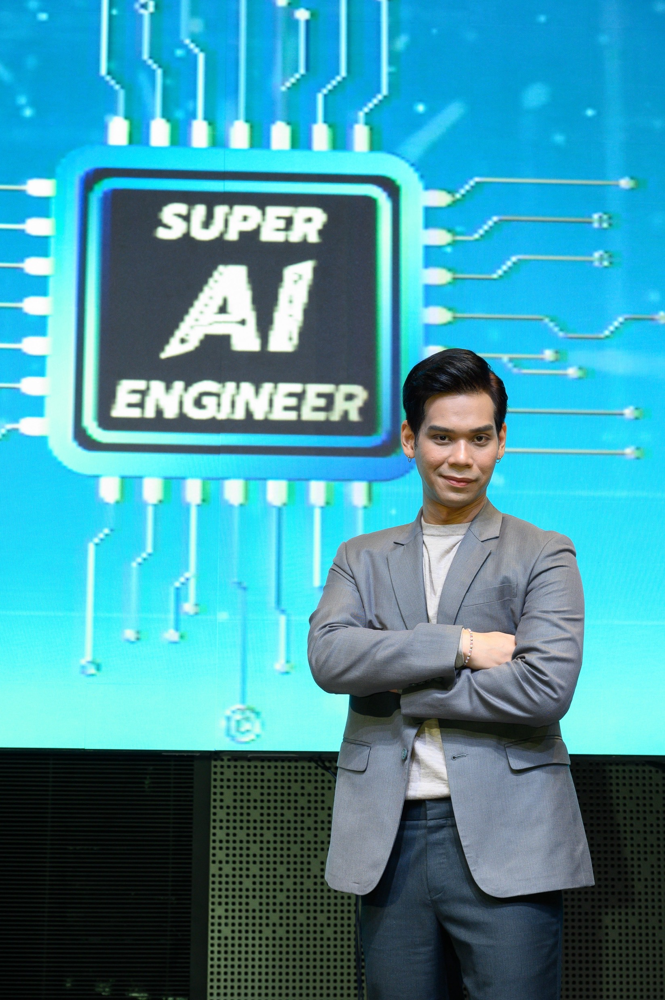

---

## Slide 4

Outline
- Introduction
- Time-domain methods
- Autoregressive integrated moving average (ARIMA)
- Convolutional analysis and CNNs
- Frequency-domain methods
- Spectral density analysis
- Wavelet analysis
- Transformer for time series
- Conclusion

---

## Slide 5

1. Introduction

---

## Slide 6

Time Series
- A sequence of data points read at equally spaced 
points of time
- E.g. daily stock price, monthly rice price, heights of ocean 
tides, audio signals, counts of celestial meteriorites, and 
activity of tectonic plates
- Time series forecasting
- Predicting future values based on previously observed 
values
- Stochastic process: observations close together in time  
are more closely related than those further apart

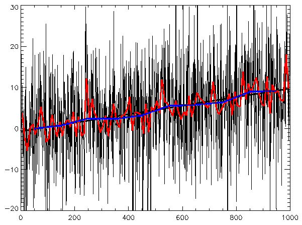

---

## Slide 7

Stationary vs. Non-Stationary
- Stationary time series is one whose statistical 
properties do not change over time
- Constant mean: average value remains the same 
throughout the time series
- Constant variance: spread of data points do not change
- Constant autocovariance: relationship between past and 
present values depends on the lag, not the time
- Non-stationary time series is one whose any of 
these properties change over time
Credit: https://medium.com/codex/what-is-stationarity-in-time-series-how-it-can-be-detected-7e5dfa7b5f6b

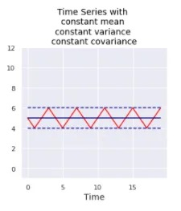

---

## Slide 8

Stationary vs. Non-Stationary
- Non-stationary time series is one whose mean, variance 
(spread), or autocovariance (lag) change over time
Credit: https://medium.com/codex/what-is-stationarity-in-time-series-how-it-can-be-detected-7e5dfa7b5f6b

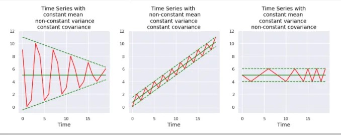

---

## Slide 9

Patterns in Time Series
- Trend: general direction over time
- Seasonality: repetitive patterns that occur at 
regular predictable intervals
- Holiday effects: irregular patterns caused by 
special calendar events
- Cycle: long-term repetitive patterns that occur 
at irregular intervals
time (t)
holiday effect
time (t)
trend
Cycle
1. Slow increase
2. Catastrophe
3. Rapid decline
season

---

## Slide 10

Assumptions about Time Series
- Time domain
- A1: Stochastic process (observations closer in 
time are more closely related)
- A2: Combination of temporal structures
- Frequency domain
- A3: Combination of continuous waves
- A4: Combination of wavelets (i.e. wavelike pieces)
- Sequence-to-sequence prediction
- A5: Transformer-based models

---

## Slide 11

2. Time-Domain Methods

---

## Slide 12

2.1 ARIMA Model

---

## Slide 13

ARIMA Model
- Auto-Regressive Integrated Moving Average
- Assumption: The dataset is seasonal and the difference 
between seasons can be predicted by linear regression
- How: Predict a future value across the season by linear 
regression of previous cross-seasonal differences and 
adjust the error by linear regression of previous errors
- Three parameters of ARIMA(p,d,q)
- Season duration: d timesteps
- No. cross-seasonal differences: p timesteps
- No. previous errors: q timesteps
time (t)
season
time (t)

---

## Slide 14

ARIMA(p,d,q)
- Step 1: Integrate the season of length d 
for every point xt in the time series
- Example: 
Season length d = 3
time (t)
season
time (t)
x→
t = xt →xt↑d
t
xt
1
10
2
15
3
20
4
25
5
28
6
38

---

## Slide 15

ARIMA(p,d,q)
- Step 1: Integrate the season of length d 
for every point xt in the time series
- Example: 
Season length d = 3
time (t)
season
time (t)
x→
t = xt →xt↑d
t
xt
xt-d
x't
1
10
—
—
2
15
—
—
3
20
—
—
4
25
10
15
5
28
15
13
6
38
20
18

---

## Slide 16

ARIMA(p,d,q)
- Step 1: Integrate the season of length d 
- Step 2: Predict the current difference with a linear 
regression of p previous differences
The term ‘autoregressive’ means taking the recent 
outputs as inputs for the next computation
time (t)
x→
t = xt →xt↑d
x→
t =
! p
"
k=1
ωkx→
t↑k
#
+ et
time (t)
predicted
difference
error
predicted
difference
error
= xt – (xt–d + diff)

---

## Slide 17

ARIMA(p,d,q)
- Step 1: Integrate the season of length d 
- Step 2: Predict the current difference with a linear 
regression of p previous differences
- Step 3: Adjust the prediction error with a linear 
regression of q previous errors
x→
t = xt →xt↑d
x→
t =
! p
"
k=1
ωkx→
t↑k
#
+ et
sha1_base64="Std
Unia5g9+f4/ZOls
EA27pu/0=">ACU
nicbVJbSxtBFJ7ES2
3qJbWPvhwMtoIYdk
WtL4LUFx8VjArZ7T
I7OZud7OylM2dLw5
LfKJS+EN86YM6iUG
8HRj4+C7MzDcTFko
acpybWn1mdm7+w8L
HxqfFpeWV5ufVC5O
XWmBH5CrXVyE3qGS
GHZKk8KrQyNQ4WY
HI/1y9+ojcyzcxoW
6Ke8n8lICk6WCpry
z7eA4Cscgqcwoi54
pkyDKjl0Rz8L8IpYB
glYT0XbyQg8Lfsx+
bAFaFNbLzODceYXe
BQj8WBgLTY0eAoFz
ZbTdiYDb4E7BS02nd
Og+dfr5aJMSOhuD
Fd1ynIr7gmKRSOGl
5psOAi4X3sWpjxFI
1fTSoZwYZlehDl2q6
MYMI+T1Q8NWaYhta
ZcorNa21Mvqd1S4o
O/EpmRUmYiceNolI
B5TDuF3pSoyA1tIA
Le1ZQcRc0H2FRq2
BPf1ld+Ci52u9/e
O9tHf2Y1rHA1tg6
2Qu+86O2Ak7ZR0m
2DW7ZXfsvav9r9uf
8mjtV6bZr6wF1Nf
Af3rJQ</latexit
>
x→
t =
! p
"
k=1
ωkx→
t↑k
#
+ et +


q
"
j=1
εjet↑j


time (t)
predicted
difference
error
time (t)
predicted
difference
adj. error

---

## Slide 18

Training Algorithm of ARIMA(p,d,q)
- Suppose each data point xt is in the training set
- Compute the differences x't for each data point
- Estimate parameters φk with MSE of all et
- Estimate parameters θk with MSE of all et with fixed φk
x→
t = xt →xt↑d
et = x→
t →
! p
"
k=1
ωkx→
t↑k
#
et = x→
t →
! p
"
k=1
ωkx→
t↑k
#
→


q
"
j=1
εjet↑j


MSE = 1
N
N
!
t=1
e2
t

---

## Slide 19

Prediction of ARIMA(p,d,q)
- Suppose we want to predict future values xt+1 to xt+N
- We compute the differences and errors of timesteps t+1 to t+N 
- We compute the future values from the differences
xt = x→
t + xt↑d
2bFAyH4ejz4g=">ACnHicfVFba9RAFJ7EW10vXfWpCHJw8QLSJRFvL6VFfaiIUMHdFj
YxTGZPNrOZXJw5KV1CfpX/xDf/jZNtHnSrHhj4+L7vXOacuFLSkOf9dNxLl69cvbZ1fXDj
5q3b28M7d6emrLXAiShVqU9iblDJAickSeFJpZHnscLjOHvX6cenqI0siy+0qjDM+aKQiR
ScLBUNv589iQgewx4Eps6jJtvz268VBFUqowys2NBu1sKzXl528jcIKEXi0RKw05ctBMEA
+zrgrsQKExo9v+qgZaLlMJN9z+b9PZoOPLG3jrgIvB7MGJ9HEXDH8G8FHWOBQnFjZn5Xk
VhwzVJobAdBLXBiouML3BmYcFzNGzXm4Ljywzh6TU9hUEa/b3jIbnxqzy2DpzTqnZ1Dryb
9qspuRN2MiqgkLcd4oqRVQCd2lYC41ClIrC7jQ0s4KIuWaC7L3HNgl+Jtfvgimz8f+q/H
Lzy9GB2/7dWyx+whe8p89podsEN2xCZMODvOvnPofHAfuO/dj+6nc6vr9Dn32B/hTn8Bu
nrIKQ=</latexit>
x→
t =
p
!
k=1
ωkx→
t↑k +
q
!
j=1
εjet↑j
et = x→
t →
" p
!
k=1
ωkx→
t↑k
#
→


q
!
j=1
εjet↑j



---

## Slide 20

Incomplete Time Series
- Interpolation techniques
- Newton’s interpolation: each ai is computed by divided differences
- Cubic spline interpolation: cubic curve
- Chebyshev’s interpolation: sinusoidal seasonality
- Radial basis function interpolation: spread around the means xi
N(x) = a0 + a1(x →x0) + a2(x →x0)(x →x1) + . . . + an
n→1
!
k=0
(x →xk)
Si(x) = ai + bi(x →xi) + ci(x →xi)2 + di(x →xi)3
xi = a + b
2
+ b →a
2
cos
!2i + 1
2n
ω
"
R(x) =
n
!
i=1
ωi · ε (|x →xi|)

---

## Slide 21

Evaluation of Prediction Models
- Mean absolute error (MAE): average absolute 
difference between prediction and gold standard
- Root mean squared error (RMSE): square root of 
mean squared difference between prediction and 
gold standard
- Mean absolute percentage error (MAPE): average 
percentage difference between prediction and gold 
standard (w.r.t. gold standard)
- Forecast bias: average bias (prediction – gold 
standard)
MAE = 1
N
N
!
k=1
|yk →ˆyk|
QEi9EKUtAaRsWHkdb2LF3t3ab5FW1v4xLvwHbr31wgGEuHKtE3JoSNZGs28p+eZOJfCoO/8mZmX7x8NTf/uvbm7bv3C/UPi8cmKzTjHZbJTJ/G1HApUt5BgZKf5pTFUt+Eo/2x/7JOdGZOkRljnvKTpIRSIYRSdF9aNQURxqZb8f/jio4BPsQGh+arQ
QJpoyG1S2VTmpUJEd7QTVWQtCyRNchTIawRcIhxRtWTkeajEY4uezNaiesNv+hPAcxJMSYNM0Y7qV2E/Y4XiKTJjekGfo49SzUKJnlVCwvDc8pGdMC7jqZUcdOzk/QVfHRKH5JMu5ciTNS/NyxVxpQqdpPjrOapNxb/53ULTLZ7VqR5gTxlj4eSQgJmMK
4S+kJzhrJ0hDIt3F+BDalrDV3hNVdC8DTyc3K81gw2mxvf1hu7e9M65skyWSGrJCBbZJd8JW3SIYxckN/khtx6l961d+fdP47OeNOdJfIPvIc/aoCtjA=</latexit>
RMSE =
!
"
"
# 1
N
N
$
k=1
(yk →ˆyk)2
I18XgJhR6qXEg/gDLFav1yl60K4ndp4DY6J/l0r+QW6+9NAQes0ta1uH1u7AwjDzHm9nwkxwDa7w9l48vTZ82tF7Xtl69e79R39/o6zRVlPZqKVA1DopngCesB8GmWJEhoINwvh87g+umNI8TS6hyNhYkmnCI04JWCmo931JYKak+fqp
+7nE73EL+5Ei1Hil6ZTY17kMTNzym8d7AsWwXl4yKI8UfszwiYogzi0ljBLig+ncF1UG+4TXcBvE68ijRQhW5Qv/UnKc0lS4AKovXIczMYG6KAU8HKmp9rlhEakykbWZoQyfTYLPKXeN8qExylyr4E8EL9e8MQqXUhQzs5T6tXvbn4P2+UQ
3Q6NjzJcmAJXR6KcoEhxfMy8YQrRkEUlhCquP0rpjNi6wFbec2W4K1GXif9g6Z3Dy6OGy0z6o6tBb9A59QB46QW30BXVRD1F0g36i3+jO+e78cu6dP8vRDafaeYP+gfPwCOHlr5A=</latexit>
MAPE = 1
N
N
!
k=1
""""
yk →ˆyk
yk
""""
bias = 1
N
N
!
k=1
(yk →ˆyk)

---

## Slide 22

2.2 Convolutional Analysis and CNNs

---

## Slide 23

Convolution ∗
- Combining two functions to produce a third 
one that represents how one amplifies the 
other in each step of their overlapping
- Continuous convolution
- Discrete convolution
- where f is an input signal and w is a kernel (i.e. 
pattern filter)
Kernel w
(flipped)
Input f
(as is)
t=0
t=1
t=2
t=3
[f →w](t) =
! →
↑→
f(ω) · w(t ↑ω) dω
[f →w](t) =
→
!
k=↑→
f[k] · w[t ↑k]
Two waves are colliding
This is our kernel w

---

## Slide 24

Cross-Correlation ⊙
- The intuitive counterpart of convolution, 
where the kernel function is not flipped
- Continuous cross-correlation
- Discrete cross-correlation
- We will say ‘convolution’ to refer to cross-
correlation for ease of understanding
This is our kernel w
="JFLzgJMEF0iSQulDj/moU1vDX+k=">ACOXi
cbZDNSiQxFIVTjo7aOmPuHRzsVHaEZsqmb+NIO
PGZQu2Cl1lk0qlNJhKiuTWSFP0a83Gt3AnuJmFI
m59AVNtLfy7EPJxzr0k98S5FBZ9/8qb+DA59XF6
ZrYxN/p80Lzy9cDqwvDeI9pqc1RTC2XQvEeCpT
8KDecZrHkh/HZTuUf/uXGCq32cZjzKMnSqSCUX
TSoNntpxDqRCOcR21cg1XYglAoHJQb7kpxODoua
4C0HSIt1iBkVX953kZYh7E0Ov4GISQVD5otv+OP
C95CUEOL1NUdNC/DRLMi4wqZpNb2Az/HqKQGBZN
81AgLy3PKzugJ7ztUNOM2Ksebj2DFKQmk2rijEM
bq84mSZtYOs9h1ZhRP7WuvEt/z+gWmv6NSqLxAr
tjTQ2khATVUMUIiDGcohw4oM8L9FdgpNZShC7vh
Qgher/wWDjY7wc/Oj73vre0/dRwzZIkskzYJyC+
yTXZJl/QI/INbkht96F9+78+6fWie8emaRvC
jv4RGa7KsH</latexit>
[f →w](t) =
! →
↑→
f(ω) · w(t + ω)↓dω
[f →w](t) =
→
!
k=↑→
f[k] · w[t + k]↓
* is the complex conjugate
e.g. (3 + 4î)* = 3 – 4î
Similarity of two waves
Kernel w
(as is)
Input f
(as is)
t=0
t=1
t=2
t=3

---

## Slide 25

Convolutional Filtering
Find
(kernel)

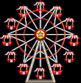

---

## Slide 26

Convolutional Filtering
Find
(kernel)
- Matched areas 
are amplified
- Objects are 
detected via 
convolution
- We have 
extracted the 
local features

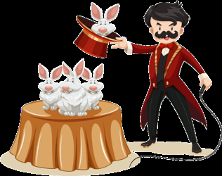

---

## Slide 27

Convolution in Time Series
- Pattern matching with kernels
- Assumption: Local features are detected by a 
series of peaks
- Period of seasonality can be identified by the 
peaks of cross-correlations
- Holiday effects are also identified by the 
irregularity in cross-correlation peaks
- One time series may align (correlate) with a 
mixture of kernels
time (t)
Kernel w1
Feature
map c1
Kernel w2
Feature
map c2

---

## Slide 28

Convolutional Neural Networks
- Learn several kernels from the dataset and 
identify which kernels to be used at which time
- Convolution layer with 3 kernels (width=10)
where each wi is a vector of 10 parameters
- Max-pooling for most prominent local features
- Nonlinear function
- The matrix is then flattened to become a vector
time (t)
c1
c2
c3
Conv1D(kernel=3, width=10)
Max Pooling
c*
ReLU
Flatten
Output vector for prediction with MLP
ci = x →wi
c→= max [c1|c2|c3]
x'
x→= ReLU(c↑)
N.B. These kernels can 
learn any shape of trends

---

## Slide 29

CNNs for Computer Vision
Feature
maps
Pooled
feature map
Feature
maps
Pooled
feature map


x1
x2
x3
...
xN


Flattened
vector
MLP
Class y

---

## Slide 30

3. Frequency-Domain Methods

---

## Slide 31

3.1 Spectral Density Analysis

---

## Slide 32

Spectral Density
- Describing a time series 
in terms of power 
distribution according to 
frequency components
- Assumption: Time 
series is a mixture of 
periodic sinusoid waves 
(seasonal patterns)
- Transforming a time 
series into spectrum 
(squared amplitude) in 
the frequency domain
Source: https://dibsmethodsmeetings.github.io/fourier-transforms/ 
Spectrum representation

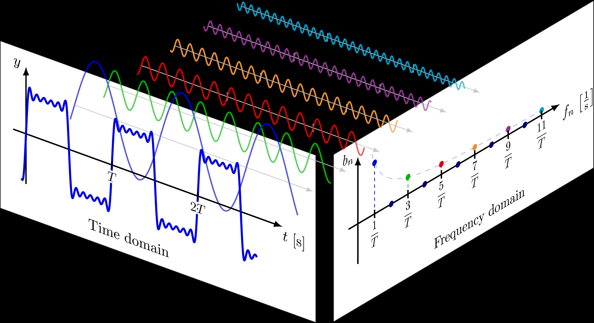

---

## Slide 33

Wave as Complex Number
- A complex number a+îb consists of the real part 
a and the imaginary part b, where î = √-1
- Wave can be represented as a complex number
u(x, t) = A cos(kx −!t + ✓)
phase
θ
Y-Axis
X-Axis
This is at time t = 0
We are at the kth wave
The beginning of the kth wave
amplitude A
frequency
Euler’s formula
exp[ˆıω]
= cos ω +ˆı sin ω
θ
radius = 1
where
a+îb
A
θ
At t = 0 and k = 0
u(x, t) = u0e→ˆı(ωt→kx)
u0 = Aeˆıω

---

## Slide 34

Wave as 3D Spiral
- Wave can be seen as a 
counterclockwise spiral in 3D 
space, whose base plane are 
real and imaginary parts
- Conjugate of a wave is 
therefore a clockwise spiral
exp[ˆıωt] = cos ωt +ˆı sin ωt
real
part
imaginary
part
exp [ˆıωt]→= exp[→ˆıωt]
= cos ωt →ˆı sin ωt

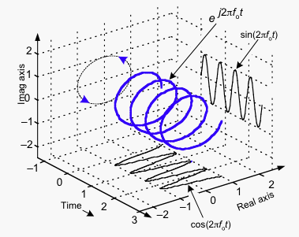

---

## Slide 35

Fourier Transform
- Fourier transform of a time series x(t) is a 
function of frequency ω that reflects how well 
x(t) aligns with the wave of frequency ω 
- The frequency is usually a multiple of 2π (i.e. 
one round of a circle in radian)
4="bCOvkAIDe+SKa+7XLx47J2/o7k=">A
CwXiclVFNb9QwEHXCV1m+tnDkMmIF2iK6ShAF
LqCKSohjkdi20jpdeR1n16odR/ak7MrKn+QE/
wYnzQG6XBjJ8tO8N2/smUWlpMk+RXFN27eu
n1n5+7g3v0HDx8Ndx+fOFNbLqbcKGPFswJU
sxRYlKnFVWML1Q4nRxcdTyp5fCOmnKb7ipRK
bZspSF5AxDaj78STXDFWfKf26AelgDbWBMjRZ
Ltgcv4AOsx7gH1OQGodNa7b+zS9H0olfQ0nT
QSqksce73w1Xgpjn3PegteGvhqVhXM7piGNjQ
sfMAzJrzl0Ahx/+w6pz2YdurM5oPR8k6QK2Q
dqDEenjeD78QXPDay1K5Io5N0uTCjPLEquR
DOgtRMV4xdsKWYBlkwLl/luAw08D5kcCmPDKR
G67J8VnmnNnoRlO0M3XWuTf6Lm9VYvM+8LK
saRcmvGhW1AjTQrhNyaQVHtQmAcSvDW4GvmGU
cw9IHYQjp9S9vg5PXk/Tt5ODrm9Hhp34cO+Qp
eUbGJCXvyCH5Qo7JlPDoY5RHOirjo1jGVWyv
pHU1zwhf0XsfwP5NcX</latexit>F{x}(ω) = x(t) →wave(ω, t)
=
! →
↑→
x(t) · exp[ˆıωt]↓dt
=
! →
↑→
x(t) · exp[↑ˆıωt] dt
time (t)
frequency (ω)
2π
4π
6π
8π
|F{x}(ω)|2

---

## Slide 36

Fourier Transform
- Fourier transform of a time series x(t) is a 
function of frequency ω that reflects how well 
x(t) aligns with the wave of frequency ω 
- The frequency is usually a multiple of 2π (i.e. 
one round of a circle in radian)
4="bCOvkAIDe+SKa+7XLx47J2/o7k=">A
CwXiclVFNb9QwEHXCV1m+tnDkMmIF2iK6ShAF
LqCKSohjkdi20jpdeR1n16odR/ak7MrKn+QE/
wYnzQG6XBjJ8tO8N2/smUWlpMk+RXFN27eu
n1n5+7g3v0HDx8Ndx+fOFNbLqbcKGPFswJU
sxRYlKnFVWML1Q4nRxcdTyp5fCOmnKb7ipRK
bZspSF5AxDaj78STXDFWfKf26AelgDbWBMjRZ
Ltgcv4AOsx7gH1OQGodNa7b+zS9H0olfQ0nT
QSqksce73w1Xgpjn3PegteGvhqVhXM7piGNjQ
sfMAzJrzl0Ahx/+w6pz2YdurM5oPR8k6QK2Q
dqDEenjeD78QXPDay1K5Io5N0uTCjPLEquR
DOgtRMV4xdsKWYBlkwLl/luAw08D5kcCmPDKR
G67J8VnmnNnoRlO0M3XWuTf6Lm9VYvM+8LK
saRcmvGhW1AjTQrhNyaQVHtQmAcSvDW4GvmGU
cw9IHYQjp9S9vg5PXk/Tt5ODrm9Hhp34cO+Qp
eUbGJCXvyCH5Qo7JlPDoY5RHOirjo1jGVWyv
pHU1zwhf0XsfwP5NcX</latexit>F{x}(ω) = x(t) →wave(ω, t)
=
! →
↑→
x(t) · exp[ˆıωt]↓dt
=
! →
↑→
x(t) · exp[↑ˆıωt] dt
time (t)
frequency (ω)
2π
4π
6π
8π
Average
the squared
amplitudes
frequency
= 2π

---

## Slide 37

Fourier Transform
- Fourier transform of a time series x(t) is a 
function of frequency ω that reflects how well 
x(t) aligns with the wave of frequency ω 
- The frequency is usually a multiple of 2π (i.e. 
one round of a circle in radian)
4="bCOvkAIDe+SKa+7XLx47J2/o7k=">A
CwXiclVFNb9QwEHXCV1m+tnDkMmIF2iK6ShAF
LqCKSohjkdi20jpdeR1n16odR/ak7MrKn+QE/
wYnzQG6XBjJ8tO8N2/smUWlpMk+RXFN27eu
n1n5+7g3v0HDx8Ndx+fOFNbLqbcKGPFswJU
sxRYlKnFVWML1Q4nRxcdTyp5fCOmnKb7ipRK
bZspSF5AxDaj78STXDFWfKf26AelgDbWBMjRZ
Ltgcv4AOsx7gH1OQGodNa7b+zS9H0olfQ0nT
QSqksce73w1Xgpjn3PegteGvhqVhXM7piGNjQ
sfMAzJrzl0Ahx/+w6pz2YdurM5oPR8k6QK2Q
dqDEenjeD78QXPDay1K5Io5N0uTCjPLEquR
DOgtRMV4xdsKWYBlkwLl/luAw08D5kcCmPDKR
G67J8VnmnNnoRlO0M3XWuTf6Lm9VYvM+8LK
saRcmvGhW1AjTQrhNyaQVHtQmAcSvDW4GvmGU
cw9IHYQjp9S9vg5PXk/Tt5ODrm9Hhp34cO+Qp
eUbGJCXvyCH5Qo7JlPDoY5RHOirjo1jGVWyv
pHU1zwhf0XsfwP5NcX</latexit>F{x}(ω) = x(t) →wave(ω, t)
=
! →
↑→
x(t) · exp[ˆıωt]↓dt
=
! →
↑→
x(t) · exp[↑ˆıωt] dt
time (t)
frequency (ω)
2π
4π
6π
8π
frequency
= 4π
Average
the squared
amplitudes

---

## Slide 38

Fourier Transform
- Fourier transform of a time series x(t) is a 
function of frequency ω that reflects how well 
x(t) aligns with the wave of frequency ω 
- The frequency is usually a multiple of 2π (i.e. 
one round of a circle in radian)
4="bCOvkAIDe+SKa+7XLx47J2/o7k=">A
CwXiclVFNb9QwEHXCV1m+tnDkMmIF2iK6ShAF
LqCKSohjkdi20jpdeR1n16odR/ak7MrKn+QE/
wYnzQG6XBjJ8tO8N2/smUWlpMk+RXFN27eu
n1n5+7g3v0HDx8Ndx+fOFNbLqbcKGPFswJU
sxRYlKnFVWML1Q4nRxcdTyp5fCOmnKb7ipRK
bZspSF5AxDaj78STXDFWfKf26AelgDbWBMjRZ
Ltgcv4AOsx7gH1OQGodNa7b+zS9H0olfQ0nT
QSqksce73w1Xgpjn3PegteGvhqVhXM7piGNjQ
sfMAzJrzl0Ahx/+w6pz2YdurM5oPR8k6QK2Q
dqDEenjeD78QXPDay1K5Io5N0uTCjPLEquR
DOgtRMV4xdsKWYBlkwLl/luAw08D5kcCmPDKR
G67J8VnmnNnoRlO0M3XWuTf6Lm9VYvM+8LK
saRcmvGhW1AjTQrhNyaQVHtQmAcSvDW4GvmGU
cw9IHYQjp9S9vg5PXk/Tt5ODrm9Hhp34cO+Qp
eUbGJCXvyCH5Qo7JlPDoY5RHOirjo1jGVWyv
pHU1zwhf0XsfwP5NcX</latexit>F{x}(ω) = x(t) →wave(ω, t)
=
! →
↑→
x(t) · exp[ˆıωt]↓dt
=
! →
↑→
x(t) · exp[↑ˆıωt] dt
time (t)
frequency (ω)
2π
4π
6π
8π
frequency
= 6π
Average
the squared
amplitudes

---

## Slide 39

Fourier Transform
- Fourier transform of a time series x(t) is a 
function of frequency ω that reflects how well 
x(t) aligns with the wave of frequency ω 
- The frequency is usually a multiple of 2π (i.e. 
one round of a circle in radian)
4="bCOvkAIDe+SKa+7XLx47J2/o7k=">A
CwXiclVFNb9QwEHXCV1m+tnDkMmIF2iK6ShAF
LqCKSohjkdi20jpdeR1n16odR/ak7MrKn+QE/
wYnzQG6XBjJ8tO8N2/smUWlpMk+RXFN27eu
n1n5+7g3v0HDx8Ndx+fOFNbLqbcKGPFswJU
sxRYlKnFVWML1Q4nRxcdTyp5fCOmnKb7ipRK
bZspSF5AxDaj78STXDFWfKf26AelgDbWBMjRZ
Ltgcv4AOsx7gH1OQGodNa7b+zS9H0olfQ0nT
QSqksce73w1Xgpjn3PegteGvhqVhXM7piGNjQ
sfMAzJrzl0Ahx/+w6pz2YdurM5oPR8k6QK2Q
dqDEenjeD78QXPDay1K5Io5N0uTCjPLEquR
DOgtRMV4xdsKWYBlkwLl/luAw08D5kcCmPDKR
G67J8VnmnNnoRlO0M3XWuTf6Lm9VYvM+8LK
saRcmvGhW1AjTQrhNyaQVHtQmAcSvDW4GvmGU
cw9IHYQjp9S9vg5PXk/Tt5ODrm9Hhp34cO+Qp
eUbGJCXvyCH5Qo7JlPDoY5RHOirjo1jGVWyv
pHU1zwhf0XsfwP5NcX</latexit>F{x}(ω) = x(t) →wave(ω, t)
=
! →
↑→
x(t) · exp[ˆıωt]↓dt
=
! →
↑→
x(t) · exp[↑ˆıωt] dt
time (t)
frequency (ω)
2π
4π
6π
8π
frequency
= 8π
Average
the squared
amplitudes

---

## Slide 40

Fourier Transform
- Fourier transform of a time series x(t) is a 
function of frequency ω that reflects how well 
x(t) aligns with the wave of frequency ω 
- The frequency is usually a multiple of 2π (i.e. 
one round of a circle in radian)
4="bCOvkAIDe+SKa+7XLx47J2/o7k=">A
CwXiclVFNb9QwEHXCV1m+tnDkMmIF2iK6ShAF
LqCKSohjkdi20jpdeR1n16odR/ak7MrKn+QE/
wYnzQG6XBjJ8tO8N2/smUWlpMk+RXFN27eu
n1n5+7g3v0HDx8Ndx+fOFNbLqbcKGPFswJU
sxRYlKnFVWML1Q4nRxcdTyp5fCOmnKb7ipRK
bZspSF5AxDaj78STXDFWfKf26AelgDbWBMjRZ
Ltgcv4AOsx7gH1OQGodNa7b+zS9H0olfQ0nT
QSqksce73w1Xgpjn3PegteGvhqVhXM7piGNjQ
sfMAzJrzl0Ahx/+w6pz2YdurM5oPR8k6QK2Q
dqDEenjeD78QXPDay1K5Io5N0uTCjPLEquR
DOgtRMV4xdsKWYBlkwLl/luAw08D5kcCmPDKR
G67J8VnmnNnoRlO0M3XWuTf6Lm9VYvM+8LK
saRcmvGhW1AjTQrhNyaQVHtQmAcSvDW4GvmGU
cw9IHYQjp9S9vg5PXk/Tt5ODrm9Hhp34cO+Qp
eUbGJCXvyCH5Qo7JlPDoY5RHOirjo1jGVWyv
pHU1zwhf0XsfwP5NcX</latexit>F{x}(ω) = x(t) →wave(ω, t)
=
! →
↑→
x(t) · exp[ˆıωt]↓dt
=
! →
↑→
x(t) · exp[↑ˆıωt] dt
time (t)
2π
4π
6π
8π
frequency
= 8π
Average
the squared
amplitudes
Spectrum

---

## Slide 41

Fast Fourier Transform (Cooley & Tukey, 1965)
def fft(x: array, N: length, s: stride):
    result := create_array(size=N)
    if N == 1:
        result[0] = x[0]
    else:
        result[0 : N/2] := fft(x, N/2, 2*s)       # x[0], x[2s], x[4s], ...
        result[N/2 : N] := fft(x[s:], N/2, 2*s)   # x[s], x[3s], x[5s], ...
        for k in range(N/2):
            p := result[k]
            q := result[k + N/2] * exp(-2 * π * î * k/N)
            result[k] := p + q
            result[k + N/2] := p - q
    return result
HOW TO RUN ==> fft(x, N, s=1) ==> Then compute the squared magnitude of each element
O(n log n) 
time 
complexity

---

## Slide 42

Combine
Fast Fourier Transform (Cooley & Tukey, 1965)
- Base case
- Recursive case
F(x[k]) = x[k]
6pr9R9ue2xl6GmpRBiJNMmvRC6GnkEKcBLTCrNYre/FK2uyOSozQpZceWkqu+Vu59Y/k3JWtQxL71IGFj5nvm+cmWkmLQfDX8+/cvXf/wcbDzqPHT54+6z5/cWSL0nAx5IUqzEnCr
FAyF0OUqMSJNoJliRLHyexLEz/+LoyVRX6Icy3ijE1ymUrO0LlG3SsNb+ET0IzhlDNV7dXRWTSLY6C0c7ouBJtAU8N4tV9Xg3pJXFU3Qu2op0BRZsICFWcaqBIpRltApwrKus204Bq
CbPaZQRq5GSK65Ju3qy6LD1vwVG3V7QDxYGqyBsQY+0djDqXtJxwctM5MgVszYKA41xQxKrkTdoaUVmvEZm4jIwZy5nuJqcZ8a3jPGNLCuJcjLzXFRXLrJ1niWM2Q9vbsca5Lha
VmH6MK5nrEkXOl4XSUgEW0BwbxtIjmruAONGul6BT5lbCbov0XFLCG+PvAqOBv1wu/h2/ve7ud2HRvkFXlN3pGQ7JBd8pUckCHhHvV+eL+83z7zf/p/PMl1fdazUtyw/yLfxwo4p
8=</latexit>
p = F[x[k]]
q = F[x[k + N
2 ]]
F[x[k]] = p + q →exp
!
↑ˆı2ωk
N
"
F[x[k + N
2 ]] = p ↑q →exp
!
↑ˆı2ωk
N
"
Time series x[1 … N]
FFT
FFT
p
q
N/2
texit 
sha1_
base6
4="jW1
YZNUt
zIzXsE
FxcZF
todf/
CRQ=">
ACJ
HicbVB
NSyNB
EO2J6
5qN7hr
16KXZ
IAiyYS
b4BV7
CevEk
CpsYSA
+hp1O
TNOmZ
abtrxD
Dkx3j
xr+zFg
+6yBy
/+Fjs
xh924D
woe71
VRVS/S
Slr0/
WevtP
Rh+eNK
+VNld
e3zl/X
qxmb
ZrkR0
BKZykw
n4haU
TKGFEh
V0tAG
eRAqu
otHp1L
+6AWN
lv7As
Yw4Y
NUxlJ
wdFKve
qLpHr
2mDGUC
ljK41
ZQpiL
H7jbIh
x4LJC
Wx4a
JoMC3p
aFKcO
8HIwRD
DXrXm
1/0Z6
HsSzEm
NzHR
q/5i/U
zkCaQ
oFLe2
G/gaw4
IblEL
BpMJyC
5qLER
9A19G
Uu5vCY
vbkhO
4pU/j
zLhKk
c7Uvy
cKnlg7
TiLXm
XAc2kV
vKv7P
6+YH
4eFTHW
OkIq3
RXGuKG
Z0mhj
tSwMC
1dgRLo
x0t1I
x5C4Sd
LlWXA
jB4sv
vSbtRD
w7rB5
f7teb
3eRxls
k2+kl
0SkCPS
JGfkg
rSIH
fkJ3k
T969
+D9v6
8tZa8
+cwW+
Qfeyt
dMqQa
</late
xit>
p + q →exp
!
↑ˆı2ωk
N
"
BxkvrnY05WKrQ+BeIpJCr/BKCcE=">ACJHicbVDJS
gNBEO1xN25Rj14ag+DFMCNu4EX04kUjArpIfR0apIm
PTNtd40YhnyMF3/FiwcXPHjxW+zEHNweFDzeq6KqXqSV
tOj797I6Nj4xOTUdGlmdm5+oby4dGz3AioiUxl5ir
iFpRMoYSFVxpAzyJFxGnaO+f3kDxsosPceuhjDhrV
TGUnB0UqO8r+kGvaYMZQKWMrjVlCmIsb5BWZtjwWSPs
thwUWwyLWmnV5w4wchWG8NGueJX/QHoXxIMSYUMcdo
v7BmJvIEUhSKW1sPfI1hwQ1KoaBXYrkFzUWHt6DuaMr
dTWExeLJH15zSpHFmXKVIB+r3iYIn1naTyHUmHNv2t9
cX/PqOcZ7YSFTnSOk4mtRnCuKGe0nRpvSgEDVdYQLI9
2tVLS5iwRdriUXQvD75b/kYrMa7FS3z7YqB4fDOKbIC
lkl6yQgu+SAHJNTUiOC3JEH8kSevXv0Xv13r5aR7zh
zDL5Ae/jE2CqpBw=</latexit>
p →q ↑exp
!
→ˆı2ωk
N
"

---

## Slide 43

Spectogram
- Heatmap is used 
for visual 
representation of 
the spectrum of 
frequency
- Time series is 
tokenized into 
equal chunks (w.r.t. 
window size) and 
analyzed with FFT
- Seasonality and 
holiday effects are 
present
- Good for stationary 
signals e.g. long-
term climate data
Source: https://en.wikipedia.org/wiki/Spectrogram 

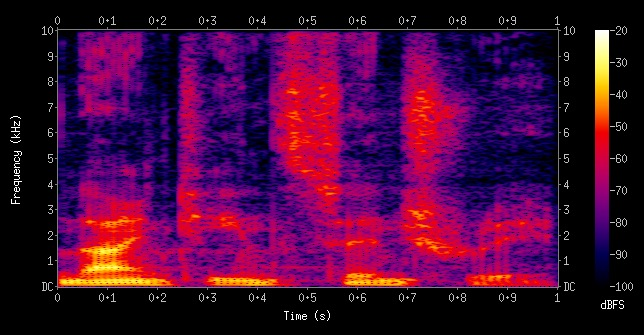

---

## Slide 44

Asynchronous Speech Recognition
- Spectrogram is used 
as an input picture for 
CNN-based models
- Local features are 
changes in specific 
frequency ranges
- Conv2D is usually 
employed
Source: https://www.microsoft.com/en-us/research/wp-content/uploads/2016/02/CNN_ASLPTrans2-14.pdf 

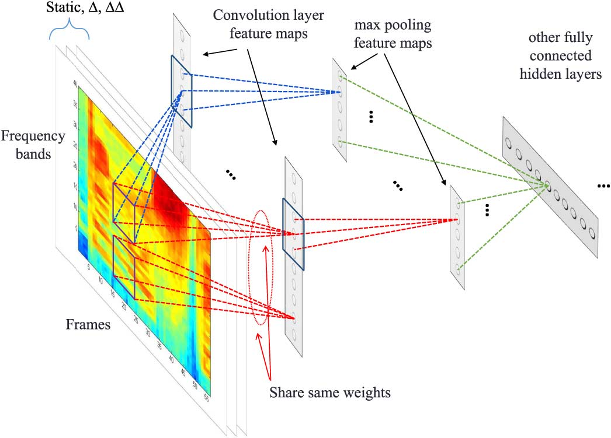

---

## Slide 45

3.2 Wavelet Analysis

---

## Slide 46

Wavelet Transform
- Wavelet transform of x(t) is a function of frequency 
a and position b that reflects how well x(t) aligns 
with the wavelet Ψ(a,b,t) 
where Morlet wavelet (1984) is used here:
- In practice, we need a low-pass filter Φ(t) to 
eliminate the inherent noise
time (t)
Morlet wavelet Ψ(a,b,t)
!(a, b, t) = cos a(t →b) exp
!
(t →b)2"
W{x}(a, b) = x(t) →!(a, b, t)
=
! →
↑→
x(t) · cos a(t ↑b) exp
"
(t ↑b)2#
dt

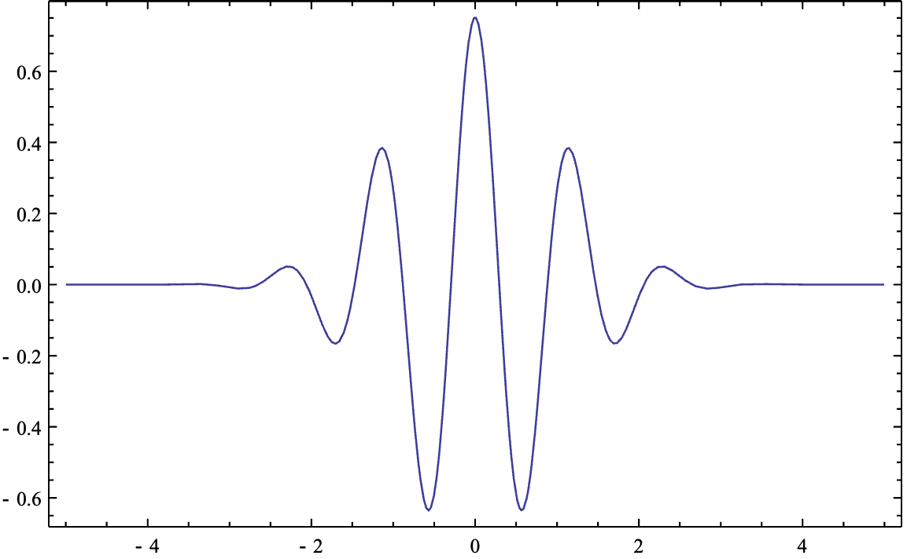

---

## Slide 47

Wavelet Transform in Time Series
- Pattern matching with wavelet
- Assumption: Local features are detected by a 
series of peaks
- Period of seasonality can be identified by the 
peaks of cross-correlations
- Holiday effects are also identified by the 
irregularity in cross-correlation peaks
- One time series may align (correlate) with a 
mixture of wavelets
time (t)
Morlet
wavelet
Feature
map

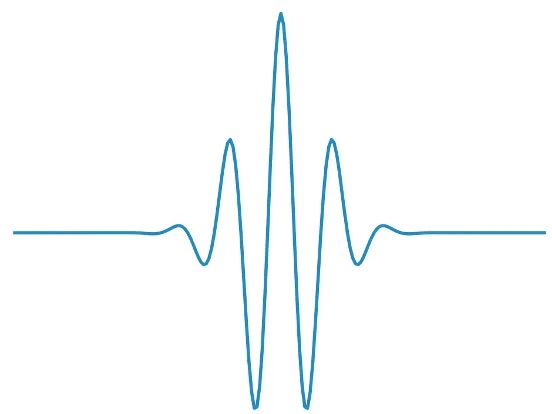

---

## Slide 48

Fast Wavelet Transform (Mallat, 1989)
def fwt(x: array, N: length, h: low-pass filter, g: wavelet, L: resolution level)
    result := []
    arr := x
    for i = 1 to L:    # Resolution i
        row = []
        for k = 0 to N/2 – 1:
            coeff := sum(g[j] * arr[2*k - j] for j = 0 to len(g))
            row.append(coeff)
        result.insert(0, row)
        arr_next := []
        for k = 0 to N/2 – 1:
            coeff := sum(h[j] * arr[2*k - j] for j = 0 to len(h))
            arr_next.append(coeff)
        arr := arr_next
     result.insert(0, arr)
     return result
O(n log n) 
time 
complexity

---

## Slide 49

Fast Wavelet Transform (Mallat, 1989)
- Iterative procedure
Time series x[1 … N] of resolution i
g
Convolve with
wavelet g
x[…]
Resolution i+1
x[…]
h
Convolve with
low-pass filter h
Noise-reduced data
SCALOGRAM
R5
R4
R3
R2
R1

---

## Slide 50

Scalogram
- Heatmap is used for 
visual representation 
of the spectrum of 
frequency
- The entire time series 
is analyzed with FWT 
to extract peaks
- Both seasonality 
(frequency) and 
holiday effects 
(positions) are present
- Good for non-
stationary and noisy 
signals e.g. speech, 
EEG, and brain waves
Source: https://www.mathworks.com/help/wavelet/gs/choose-a-wavelet.html 
- Peak reflects existence of 
a wavelet
- Horizontal ridge means 
time-consistent frequency
- Vertical ridge means 
sequence of constant 
frequency
- Separate ridges show a 
mixture of several tunes

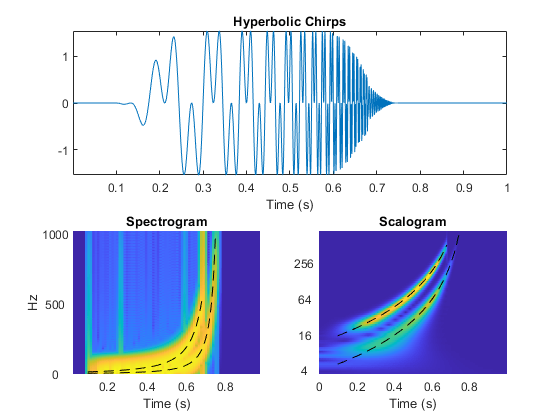

---

## Slide 51

Heart Sound Classification via Wavelets
Lee, J.-A., & Kwak, K.-C. (2023). Heart Sound Classification Using Wavelet Analysis Approaches and Ensemble of Deep Learning 
Models. Applied Sciences, 13(21), 11942.

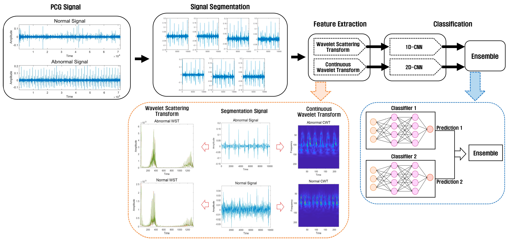

---

## Slide 52

Brain Wave-to-Word Classification
- Scalogram is used 
as an input picture 
for CNN-based 
models
- Stimulations and 
background noises 
are preserved
- Conv2D is usually 
employed
Source: https://www.mathworks.com/company/user_stories/
ut-austin-researchers-convert-brain-signals-to-words-and-phrases-using-wavelets-and-deep-learning.html 

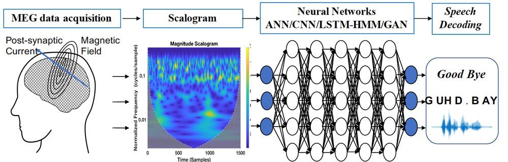

---

## Slide 53

From Wavelet to JPEG
- Each wavelet of different resolutions 
extracts pixel changes in the image 
via Haar wavelet
- Compression becomes 
multiresolution extraction via fast 
wavelet transform
- Image can be reconstructed by 
combining these pixel changes

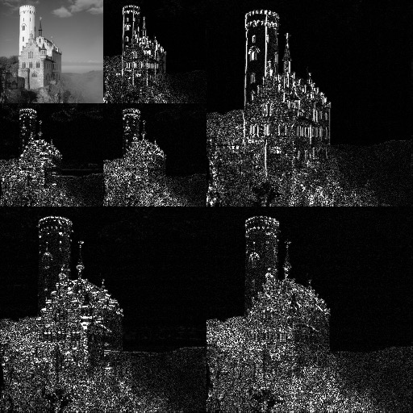

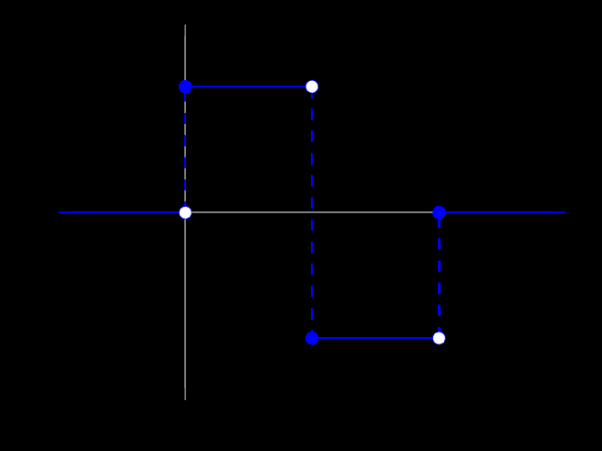

---

## Slide 54

4. Transformer for Time Series

---

## Slide 55

Transformer Model (Vaswani et al., 2016)
- Sequence-to-sequence generation
- Translation: It learns how to produce a target 
sequence from a source sequence, given a very 
large dataset of sequence pairs
- Pros: It learns word collocations and phrase 
structures on the input and output sequences, 
and associates them cross-lingually in the table 
of translation alignments
- Cons: It consists of an expansive amount of 
neuron cells, and the training process can be 
quite time-consuming
TRANSFORMER
Source: sequence of words (prompt)
Target: sequence of words (response)
Who
is
the
current
president
of
the
US
The
president
of
the
US
is
Joe
Biden

---

## Slide 56

Scaled Dot-Product Attention
- Semantic similarity ⇒ search engine
- Query is compared against each key with dot product
- The more similar the key is to the query, the more 
weight its value will get
Query
Keys
Values
Weights
Scaled
Values
Combined
Result
RSKblxJBfuATh0yaYNzUzGJFMpw3ycGz/AnV/gxoUibsVMOxVtvRA4Oem5vjhoxKZrPxtz8wuLScm4lv7q2vrFZ2NquSx4JTGqYMy6aLpKE0YDUFWMNENBkO8y0nD7F6neGBAhKQ9u1DAkbR91A+pRjJSmnELr3qHwANqh4KHi0P
aR6rle3E80beMOVz/UXQJtOz+5iUS7ytCWke/EtGwlt1cwHTXRB3qAUyiaJXNUcBZYGSiCrKpO4cnucBz5JFCYISlblhmqdoyEopiRJG9HkoQI91GXtDQMkE9kOx6FkMB9zXSgx4U+gYIj9rcjRr6UQ9/VnemOclpLyf+0VqS8s3ZMgzB
SJMDjh7yIQR1XmijsUEGwYkMNEBZU7wpxDwmElc49r0Owpr8C+pHJeukZF0fFyvnWRw5sAv2wCGwCmogEtQBTWAwQN4AW/g3Xg0Xo0P43PcOmdknh3wp4yvb9gHsWU=</latexit>wi / ki · q
r =
N
X
i=1
wivi
w = Softmax(K ⇥q)
r = V> ⇥w
Simple
Form
Matrix
Form

---

## Slide 57

Mary
looks
this
word
up
Scaled Dot-Product Attention
- Semantic similarity ⇒ search engine
- Query is compared against each key with dot product
- The more similar the key is to the query, the more 
weight its value will get
Query
Keys
Values
Weights
Scaled
Values
Combined
Result
RSKblxJBfuATh0yaYNzUzGJFMpw3ycGz/AnV/gxoUibsVMOxVtvRA4Oem5vjhoxKZrPxtz8wuLScm4lv7q2vrFZ2NquSx4JTGqYMy6aLpKE0YDUFWMNENBkO8y0nD7F6neGBAhKQ9u1DAkbR91A+pRjJSmnELr3qHwANqh4KHi0P
aR6rle3E80beMOVz/UXQJtOz+5iUS7ytCWke/EtGwlt1cwHTXRB3qAUyiaJXNUcBZYGSiCrKpO4cnucBz5JFCYISlblhmqdoyEopiRJG9HkoQI91GXtDQMkE9kOx6FkMB9zXSgx4U+gYIj9rcjRr6UQ9/VnemOclpLyf+0VqS8s3ZMgzB
SJMDjh7yIQR1XmijsUEGwYkMNEBZU7wpxDwmElc49r0Owpr8C+pHJeukZF0fFyvnWRw5sAv2wCGwCmogEtQBTWAwQN4AW/g3Xg0Xo0P43PcOmdknh3wp4yvb9gHsWU=</latexit>wi / ki · q
r =
N
X
i=1
wivi
Simple
Form
w = Softmax(K ⇥q)
r = V> ⇥w
Matrix
Form
‘looks’
For word sequence, 
collocating words 
are semantically 
similar to each other
e.g. ‘looks ___ up’

---

## Slide 58

Self-Attention
- Scaled dot-product attention whose queries 
and keys are the same
- Collocations will have almost similar results
Mary
looks
this
word
up
Keys
Values
Mary
looks
this
word
up
Queries
Mary
looks
this
word
up
Mary
looks
this
word
up
Combined
Results
Matrix
Form
W = Softmax(K ⇥K>)
R = W ⇥V

---

## Slide 59

Cross-Attention
- Scaled dot-product attention whose queries 
are the target and whose keys are the source
- Collocation alignment via semantic similarity
Mary
looks
this
word
up
Keys
(source)
Values
แมรี
ค้นหา
คำ
นี้
Queries
(target)
Mary
looks
this
word
up
แมรี
ค้นหา
คำ
นี้
Combined
Results
Matrix
Form
W = Softmax(Q ⇥K>)
R = W ⇥V

---

## Slide 60

Multihead Attention
- Scaled dot-product attention has a drawback
- It recognizes only one type of word collocation
- If we assume more than one type of word 
collocation per sequence, then we have to combine 
multiple attention heads [default = 8 heads]
Scaled
dot-product
attention
Scaled
dot-product
attention
Queries
Keys
Values
LINEAR
LINEAR
CONCATENATION
LINEAR
Result
Mary
Poppins
looks
this
word
up
Mary
Poppins
looks
this
word
up
Mary
Poppins
looks
this
word
up
Mary
Poppins
looks
this
word
up
HEAD 1 (looks ___ up)
HEAD 2 (Mary Poppins)
Notation
Multihead
attention (n)
Q
K
V

---

## Slide 61

Informer
(Zhou et al., AAAI-2021)
Decoder
Outputs
Masked Multi-head
ProbSparse
Self-attention
Multi-head
Attention
Encoder
Inputs:    Xen
Concatenated Feature Map
Inputs:    Xde={Xtoken, X0}
0 0 0 0 0 0 0
Fully Connected Layer
Multi-head
ProbSparse
Self-attention
Multi-head
ProbSparse
Self-attention
Scalar
Stamp
T = t
T = t + Dx
L
d
Conv1d
L
d
Embedding
+
L
k
L
n-heads
Attention Block 1
Conv1d
MaxPool1d,
padding=2
L/2
k
L/2
n-heads
Attention Block 2
Conv1d
MaxPool1d,
padding=2
L/4
k
L/4
n-heads
Attention Block 3
L/4
d
Feature
Map
Overview
Encoder
Block
ProbSparse Self-attention Based on the proposed mea-
surement, we have the ProbSparse self-attention by allowing
each key to only attend to the u dominant queries:
A(Q, K, V) = Softmax(QK>
p
d
)V
,
(3)
where Q is a sparse matrix of the same size of q and it
only contains the Top-u queries under the sparsity measure-
ment M(q, K). Controlled by a constant sampling factor c,
we set u = c · ln LQ, which makes the ProbSparse self-
attention only need to calculate O(ln LQ) dot-product for
each query-key lookup and the layer memory usage main-
tains O(LK ln LQ). Under the multi-head perspective, this
i
diff
k
i
f
h

---

## Slide 62

Autoformer (Wu et al., NIPS-2021)
Input Data Mean
Auto-
Correlation
Series
Decomp
Trend-cyclical Init
Seasonal Init
Feed 
Forward
Series
Decomp
Auto-
Correlation
Series
Decomp
Auto-
Correlation
N x
M x
+
Encoder Input
Autoformer Decoder
Autoformer Encoder
+
Prediction
+
+
+
Feed 
Forward
Series
Decomp
+
Series
Decomp
+
+
+
Zero
To Predict
Zero
Data
Mean
Time
Series
Seasonal
Part
Trend
-cyclical
Part
K
V
Q
K
V
Q
K
V
Q
SeriesDecomp
Output = (Xs, Xt)
Xt = AvgPool(Padding(X))
Xs = X −Xt,
Autocorrelation
Block
…
L
Q
K
V
FFT
x
FFT
Inverse FFT
Time Delay Agg
Linear
Linear
Linear
Linear
Concat
LxC
SxC
SxC
LxCx2
LxC
LxC
LxCx2
Conjugate
LxCx2
LxC
Resize
Resize
LxC
Roll(     )
Roll(     )
Roll(     )
x
x
x
…
Fusion
Time
Delay
Top k
kxC
SoftMax
⌧1
⌧2
⌧k
R(⌧1)
R(⌧2)
R(⌧k)

---

## Slide 63

5. Conclusion

---

## Slide 64

Patterns in Time Series
- Trend: general direction over time
- Seasonality: repetitive patterns that occur at 
regular predictable intervals
- Holiday effects: irregular patterns caused by 
special calendar events
- Cycle: long-term repetitive patterns that occur 
at irregular intervals
time (t)
holiday effect
time (t)
trend
Cycle
1. Slow increase
2. Catastrophe
3. Rapid decline
season

---

## Slide 65

Time-Series Models
Models
Trend
Seasonality
Holiday Effects
Cycle
Suitable for
Signal Types
ARIMA
Yes
(learned by linear 
regression)
Yes
(limited season 
length)
No
No
—
Convolution
Yes
(learned by CNNs)
Yes
(limited window size)
Yes
(learned by CNNs)
Possibly no
(due to limited 
window size)
—
Spectral 
density
Yes
(learned by CNNs)
Yes
(limited window size)
Yes
(learned by CNNs)
Yes
(present in 
spectogram)
Stationary
Wavelet 
analysis
Yes
(learned by CNNs)
Yes
(unlimited window 
size)
Yes
(learned by CNNs)
Yes
(present in 
scalogram)
Stationary and 
non-stationary
Transformer 
models
Yes
(learned by attention)
Yes
(limited time delay)
Yes
(learned by attention)
Possibly no
(due to limited
time delay)
Stationary and 
non-stationary

---

## Slide 66

Thank You
prachya@siit.tu.ac.th 
kaamanita@gmail.com 

---

