1 


5/19/25 

## Chapter 10: Time Series Analysis 

## Prachya Boonkwan (Arm) 

School of ICT, SIIT, Thammasat University `prachya@siit.tu.ac.th` , `kaamanita@gmail.com` 

**==> picture [262 x 452] intentionally omitted <==**

2 


5/19/25 

**==> picture [393 x 486] intentionally omitted <==**

```
https://tinyurl.com/5b6ch5px
```

3 


5/19/25 

## Who? Me? 

- Nickname: Arm (P’/N’ Arm, etc.) 

- Born: Aug 1981 

- Work 

   - Researcher at NECTEC 2005-2024 

   - Lecturer at SIIT, Thammasat University 2025-now 

- Education 

   - B.Eng & M.Eng, CPE Kasetsart University 

   - Obtained Ministry of Science Scholarship in early 2008 

   - Did a PhD in Informatics (AI & Computational Linguistics) at University of Edinburgh, UK from 2008 to 2013 (4.5 years) 

**==> picture [338 x 511] intentionally omitted <==**

4 


5/19/25 

## Outline 

- Introduction 

- Time-domain methods 

   - Autoregressive integrated moving average (ARIMA) 

   - Convolutional analysis and CNNs 

- Frequency-domain methods 

   - Spectral density analysis 

   - Wavelet analysis 

- Transformer for time series 

- Conclusion 

5 


5/19/25 

## 1. Introduction 

6 


5/19/25 

## Time Series 

- A sequence of data points read at equally spaced points of time 

   - E.g. daily stock price, monthly rice price, heights of ocean tides, audio signals, counts of celestial meteriorites, and activity of tectonic plates 

**==> picture [301 x 223] intentionally omitted <==**

- Time series forecasting 

   - Predicting future values based on previously observed values 

   - Stochastic process: observations close together in time are more closely related than those further apart 

7 


5/19/25 

## Stationary vs. Non-Stationary 

- Stationary time series is one whose statistical properties do not change over time 

   - Constant mean: average value remains the same throughout the time series 

   - Constant variance: spread of data points do not change 

   - Constant autocovariance: relationship between past and present values depends on the lag, not the time 

- Non-stationary time series is one whose any of these properties change over time 

**==> picture [225 x 263] intentionally omitted <==**

Credit: `https://medium.com/codex/what-is-stationarity-in-time-series-how-it-can-be-detected-7e5dfa7b5f6b` 

8 


5/19/25 

## Stationary vs. Non-Stationary 

- Non-stationary time series is one whose mean, variance (spread), or autocovariance (lag) change over time 

**==> picture [704 x 273] intentionally omitted <==**

Credit: `https://medium.com/codex/what-is-stationarity-in-time-series-how-it-can-be-detected-7e5dfa7b5f6b` 

9 


5/19/25 

## Patterns in Time Series 

- Trend: general direction over time 

- Seasonality: repetitive patterns that occur at regular predictable intervals 

- Holiday effects: irregular patterns caused by special calendar events 

**==> picture [278 x 102] intentionally omitted <==**

**----- Start of picture text -----**<br>

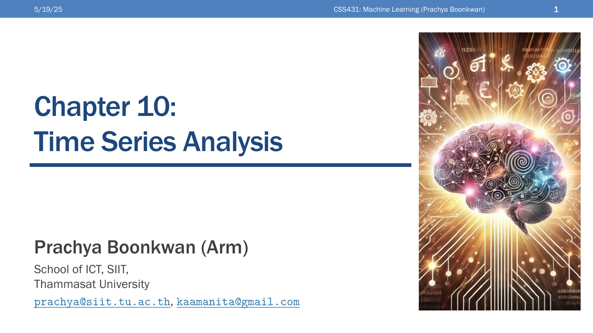

season holiday effect<br>trend<br>**----- End of picture text -----**<br>


**==> picture [55 x 16] intentionally omitted <==**

**----- Start of picture text -----**<br>

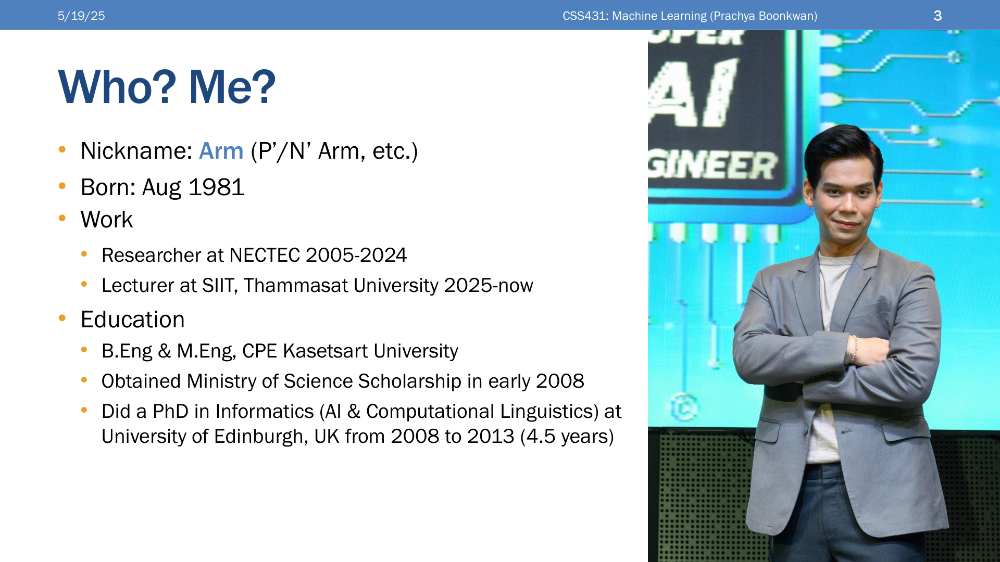

time ( t )<br>**----- End of picture text -----**<br>

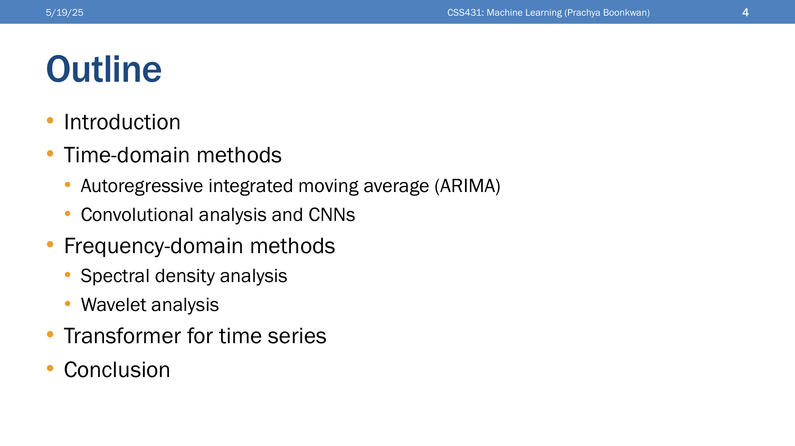


- Cycle: long-term repetitive patterns that occur at irregular intervals 

Cycle 

1. Slow increase 

2. Catastrophe 

3. Rapid decline 

time ( _t_ ) 

10 


5/19/25 

## Assumptions about Time Series 

- Time domain 

   - A1: Stochastic process (observations closer in time are more closely related) 

   - A2: Combination of temporal structures 

- Frequency domain 

   - A3: Combination of continuous waves 

   - A4: Combination of wavelets (i.e. wavelike pieces) 

- Sequence-to-sequence prediction 

   - A5: Transformer-based models 

11 


5/19/25 

## 2. Time-Domain Methods 

12 


5/19/25 

2.1 ARIMA Model 

13 


5/19/25 

## ARIMA Model 

- Auto-Regressive Integrated Moving Average 

   - Assumption: The dataset is seasonal and the difference between seasons can be predicted by linear regression 

   - How: Predict a future value across the season by linear regression of previous cross-seasonal differences and adjust the error by linear regression of previous errors 

- Three parameters of ARIMA( _p_ , _d_ , _q_ ) 

   - Season duration: _d_ timesteps 

   - No. cross-seasonal differences: _p_ timesteps 

   - No. previous errors: _q_ timesteps 

**==> picture [55 x 10] intentionally omitted <==**

**----- Start of picture text -----**<br>

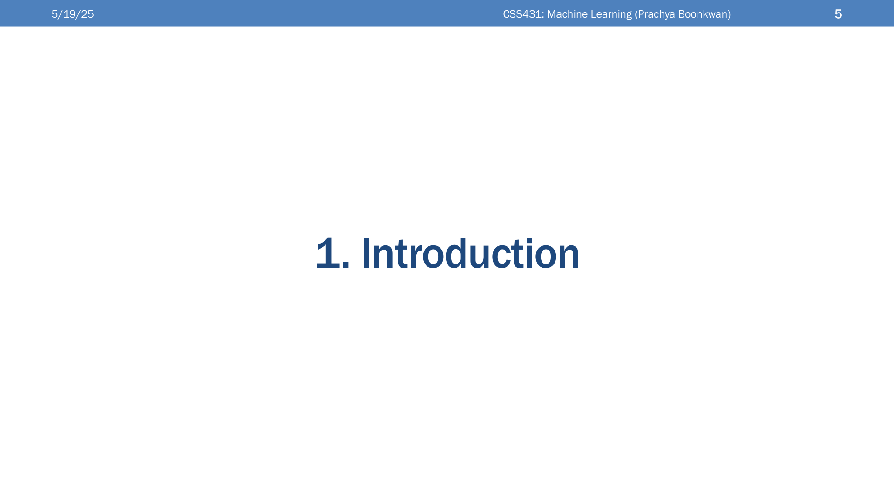

season<br>**----- End of picture text -----**<br>

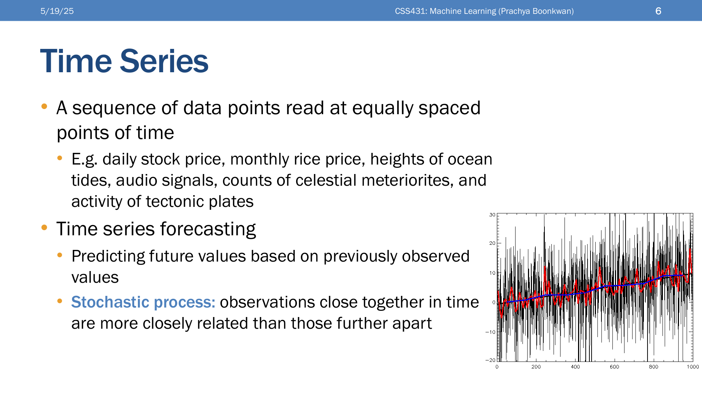


**==> picture [56 x 16] intentionally omitted <==**

**----- Start of picture text -----**<br>

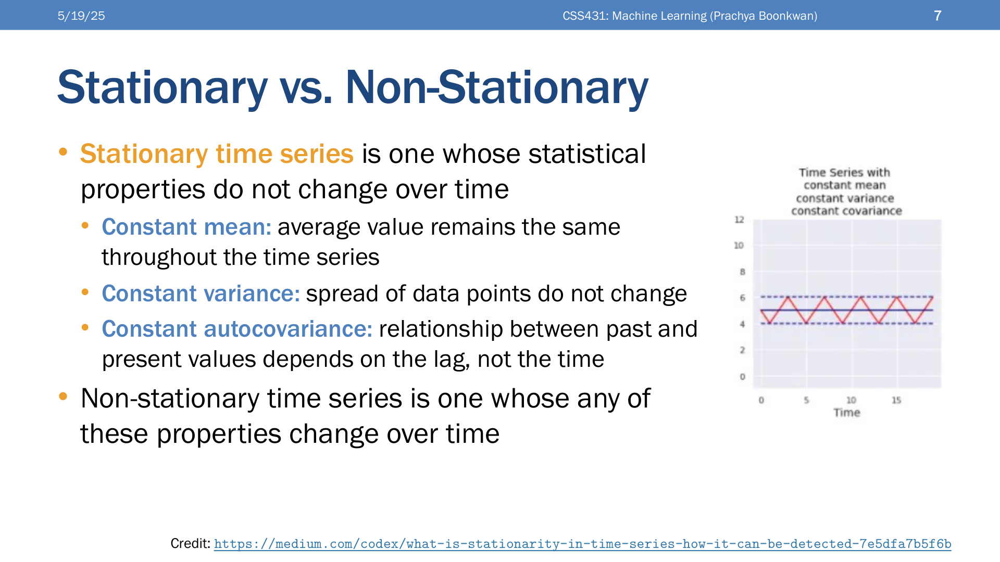

time ( t )<br>**----- End of picture text -----**<br>

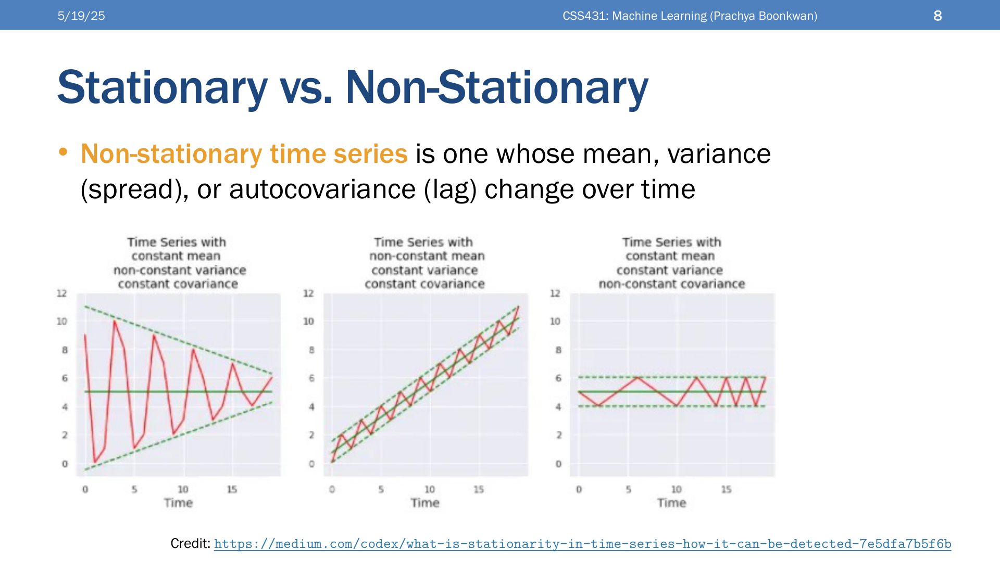


**==> picture [70 x 43] intentionally omitted <==**

**==> picture [218 x 142] intentionally omitted <==**

time ( _t_ ) 

14 


5/19/25 

## _d_ ARIMA( _p_ , , _q_ ) 

• Step 1: Integrate the season of length _d x[→] t_[=] _[ x][t][→][x][t][↑][d]_ 

for every point _xt_ in the time series 

- Example: Season length _d_ = 3 

|_t_|_xt_|
|---|---|
|1|10|
|2|15|
|3|20|
|4|25|
|5|28|
|6|38|


**==> picture [55 x 10] intentionally omitted <==**

**----- Start of picture text -----**<br>

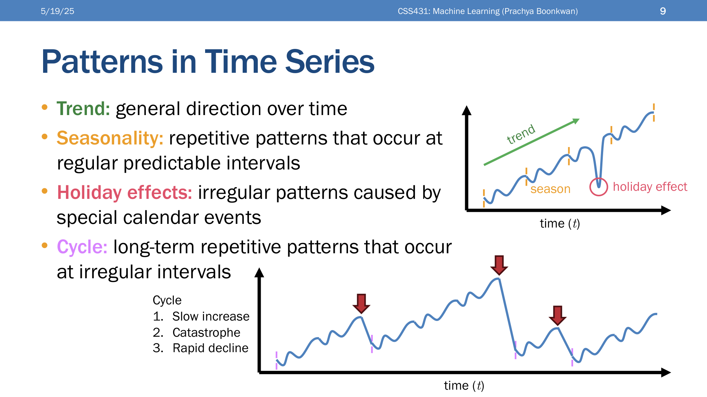

season<br>**----- End of picture text -----**<br>

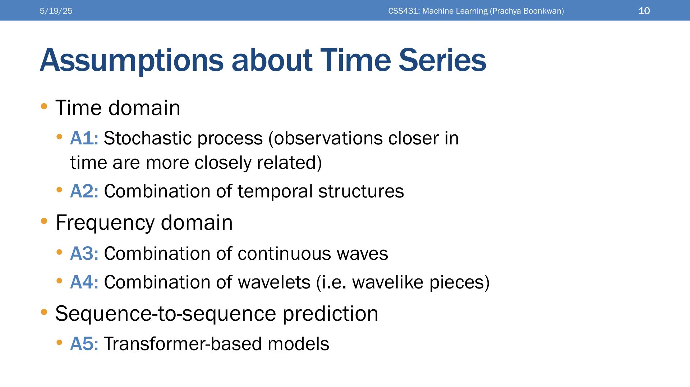


**==> picture [56 x 16] intentionally omitted <==**

**----- Start of picture text -----**<br>

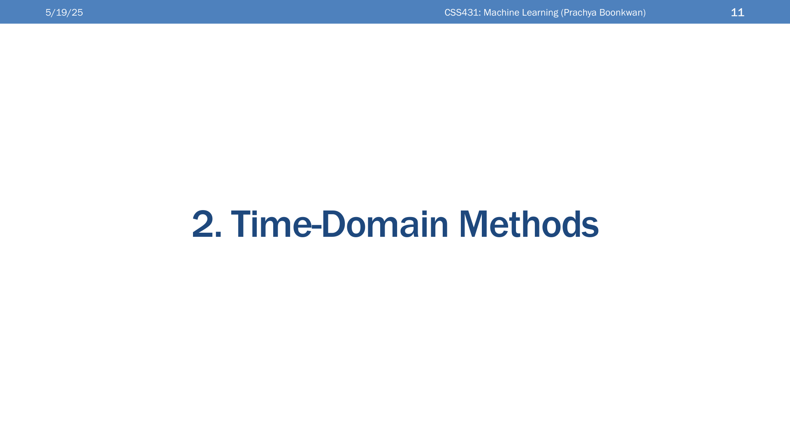

time ( t )<br>**----- End of picture text -----**<br>

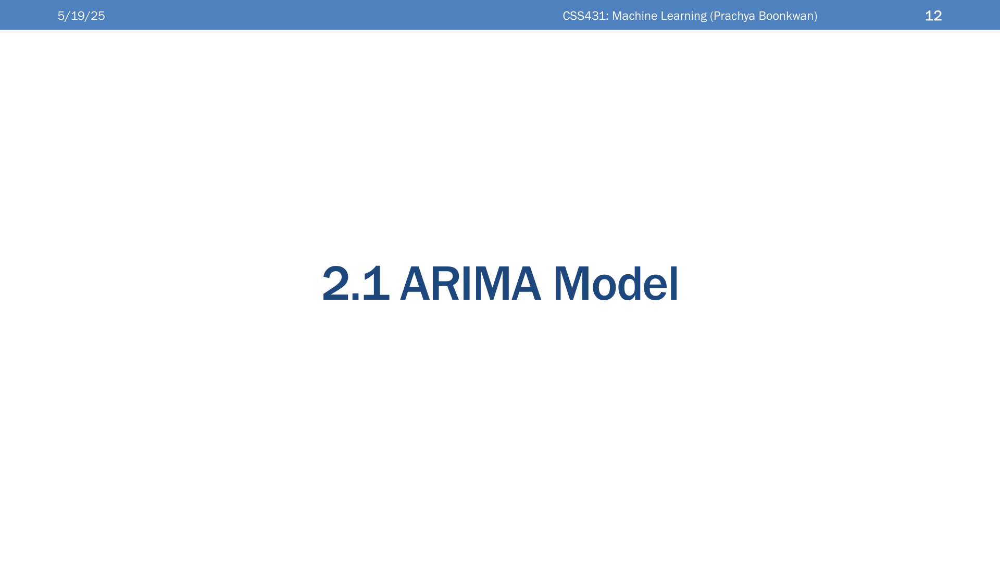


**==> picture [70 x 43] intentionally omitted <==**

**==> picture [218 x 142] intentionally omitted <==**

time ( _t_ ) 

15 


5/19/25 

## _d_ ARIMA( _p_ , , _q_ ) 

• Step 1: Integrate the season of length _d x[→] t_[=] _[ x][t][→][x][t][↑][d]_ 

for every point _xt_ in the time series 

- Example: Season length _d_ = 3 

|_t_|_xt_|_xt_-_d_|_x't_|
|---|---|---|---|
|1|10|—|—|
|2|15|—|—|
|3|20|—|—|
|4|25|10|15|
|5|28|15|13|
|6|38|20|18|


**==> picture [55 x 10] intentionally omitted <==**

**----- Start of picture text -----**<br>

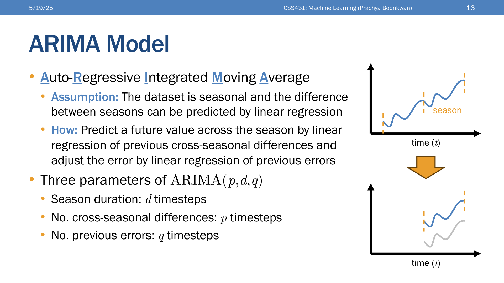

season<br>**----- End of picture text -----**<br>

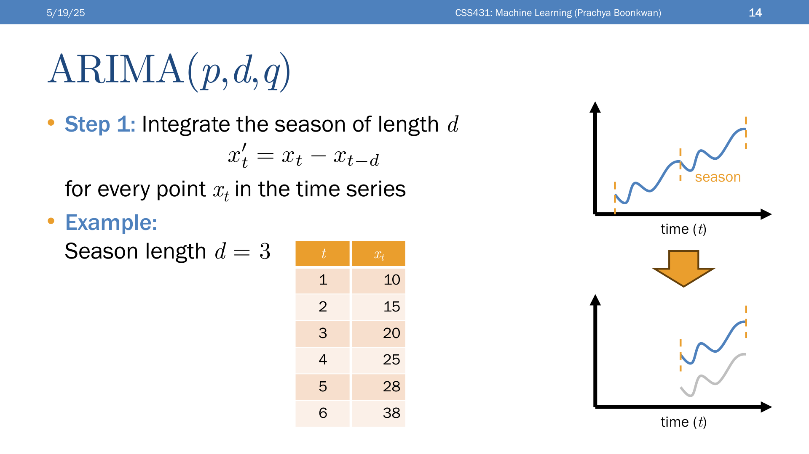


time ( _t_ ) 

**==> picture [70 x 43] intentionally omitted <==**

**==> picture [218 x 142] intentionally omitted <==**

time ( _t_ ) 

16 


5/19/25 

## _d_ ARIMA( _p_ , , _q_ ) 

• Step 1: Integrate the season of length _d x[→] t_[=] _[ x][t][→][x][t][↑][d]_ 

- Step 2: Predict the current difference with a linear regression of _p_ previous differences 

_p x[→] t_[=] _ωkx[→] t↑k_ + _et_ � � _k_ =1 � predicted error difference = _x x_ – _t_ – ( _t d_ + diff) 

The term ‘autoregressive’ means taking the recent outputs as inputs for the next computation 

**==> picture [218 x 142] intentionally omitted <==**

**==> picture [55 x 16] intentionally omitted <==**

**----- Start of picture text -----**<br>

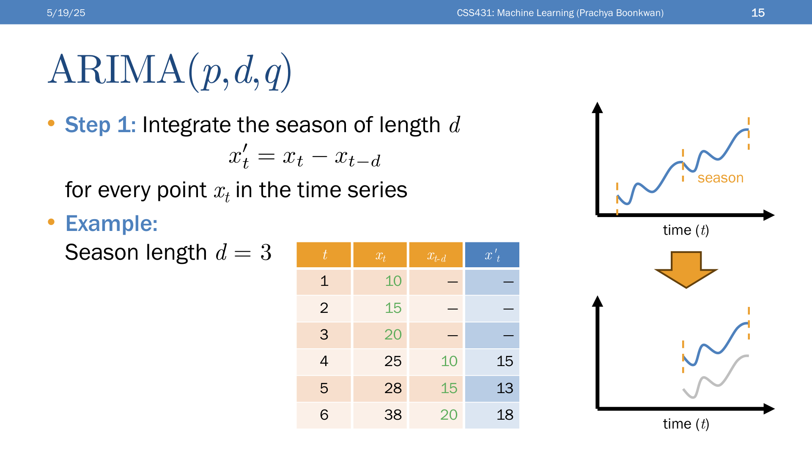

time ( t )<br>**----- End of picture text -----**<br>

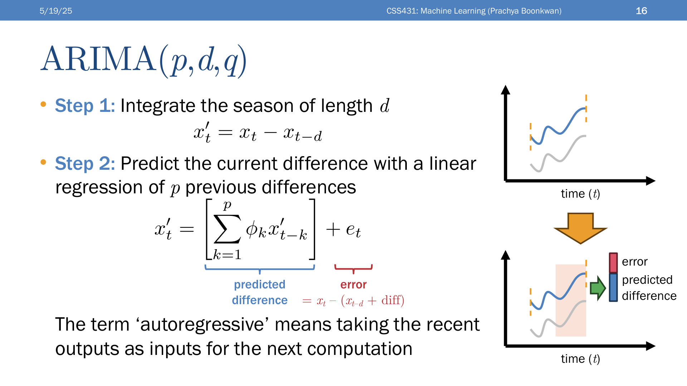


**==> picture [77 x 58] intentionally omitted <==**

**----- Start of picture text -----**<br>

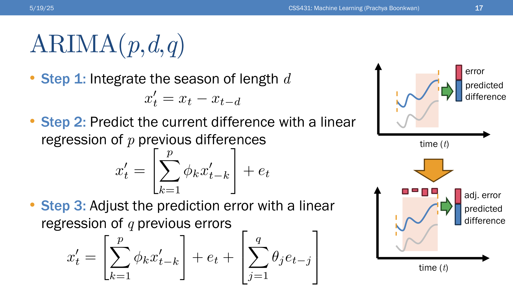

error<br>predicted<br>difference<br>**----- End of picture text -----**<br>

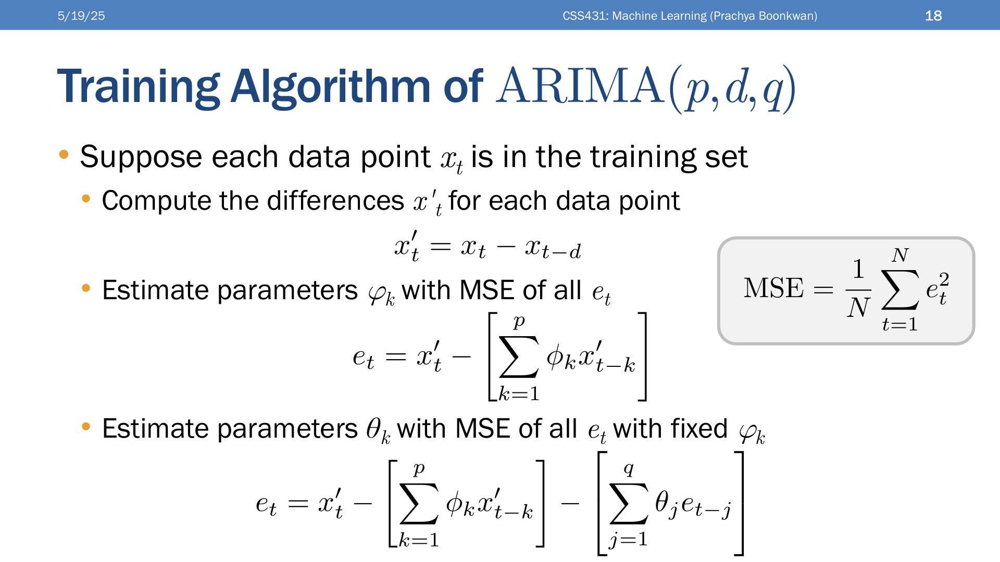


time ( _t_ ) 

17 


5/19/25 

## _d_ ARIMA( _p_ , , _q_ ) 

- Step 1: Integrate the season of length _d x[→] t_[=] _[ x][t][→][x][t][↑][d]_ 

- Step 2: Predict the current difference with a linear regression of _p_ previous differences 

_p x[→] t_[=] _ωkx[→] t↑k_ + _et_ � � _k_ =1 � 

• Step 3: Adjust the prediction error with a linear regression of _q_ previous errors _p q_   _x[→] t_[=] _ωkx[→] t↑k_ + _et_ + _εjet↑j_ � � � _k_ =1 � _j_ =1   

**==> picture [56 x 16] intentionally omitted <==**

**----- Start of picture text -----**<br>

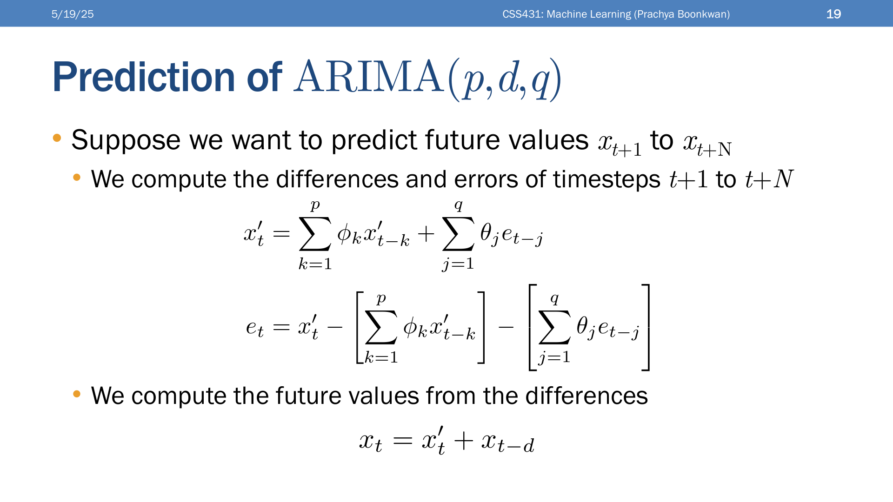

time ( t )<br>**----- End of picture text -----**<br>

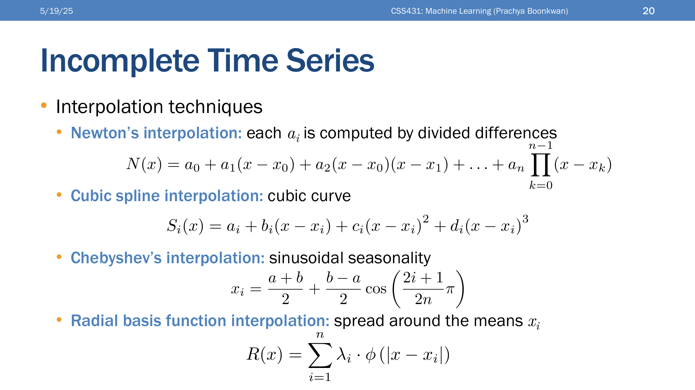


**==> picture [55 x 16] intentionally omitted <==**

**----- Start of picture text -----**<br>

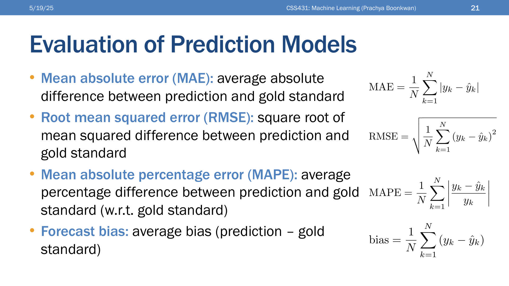

time ( t )<br>**----- End of picture text -----**<br>

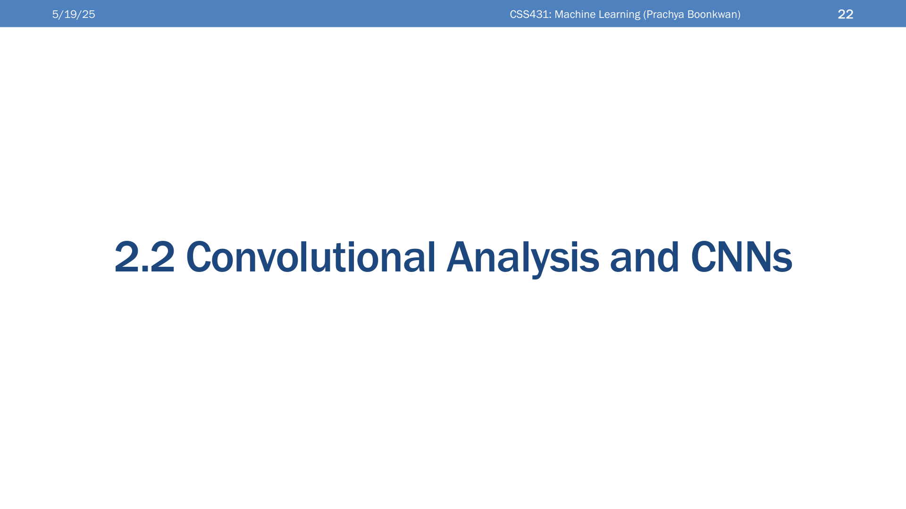


**==> picture [78 x 58] intentionally omitted <==**

**----- Start of picture text -----**<br>

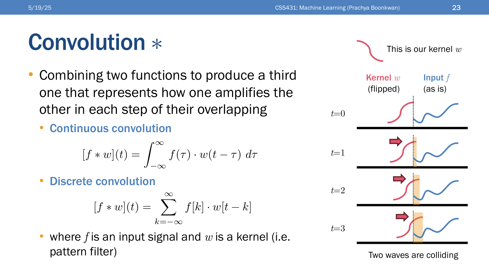

error<br>predicted<br>difference<br>**----- End of picture text -----**<br>

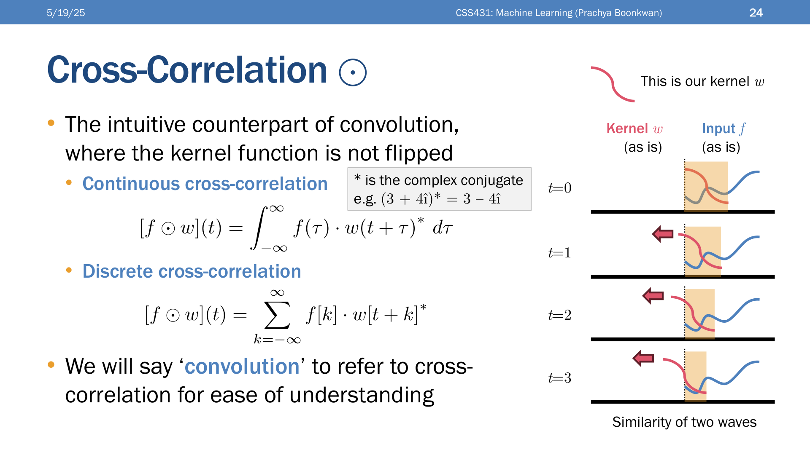


**==> picture [77 x 61] intentionally omitted <==**

**----- Start of picture text -----**<br>

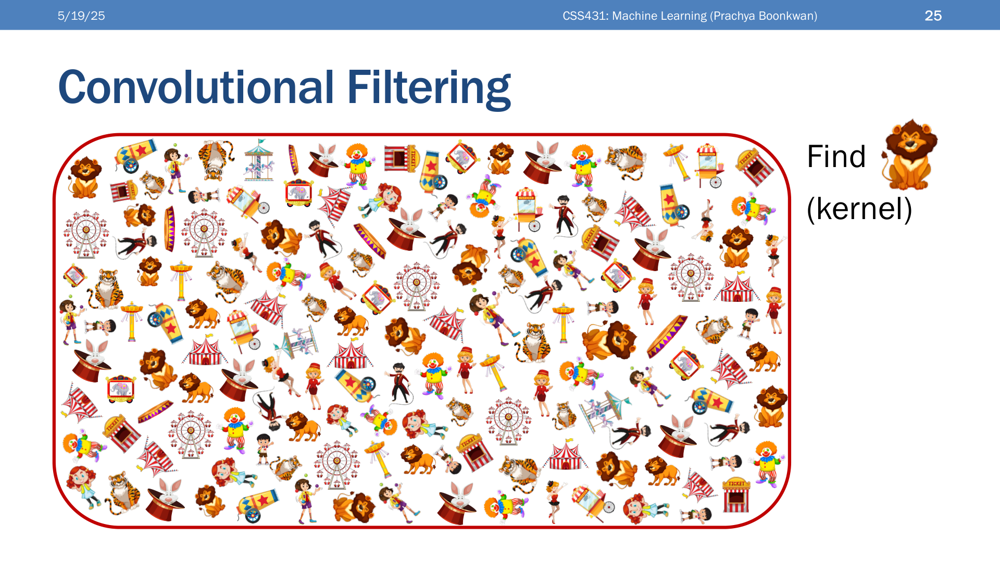

adj. error<br>predicted<br>difference<br>**----- End of picture text -----**<br>

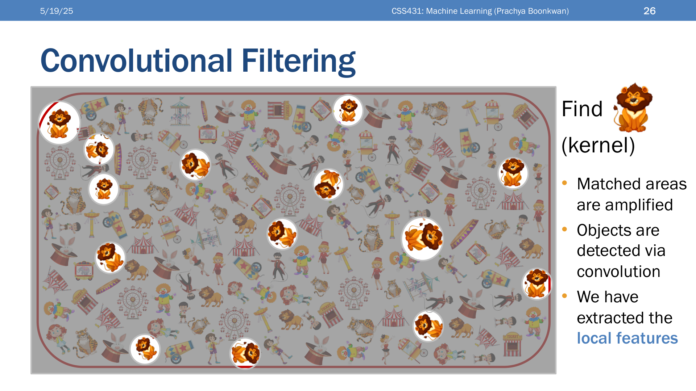


18 


5/19/25 

## Training Algorithm of ARIMA( _p_ , _d_ , _q_ ) 

## • _x_ Suppose each data point _t_ is in the training set 

- Compute the differences _x't_ for each data point 

_x[→] t_[=] _[ x][t][→][x][t][↑][d]_ with MSE of all _et_ φ _k t p et_ = _x[→] t[→] ωkx[→] t↑k_ � � _k_ =1 � 

# • Estimate parameters φ _k_ with MSE of all _et_ 

**==> picture [246 x 103] intentionally omitted <==**

**----- Start of picture text -----**<br>

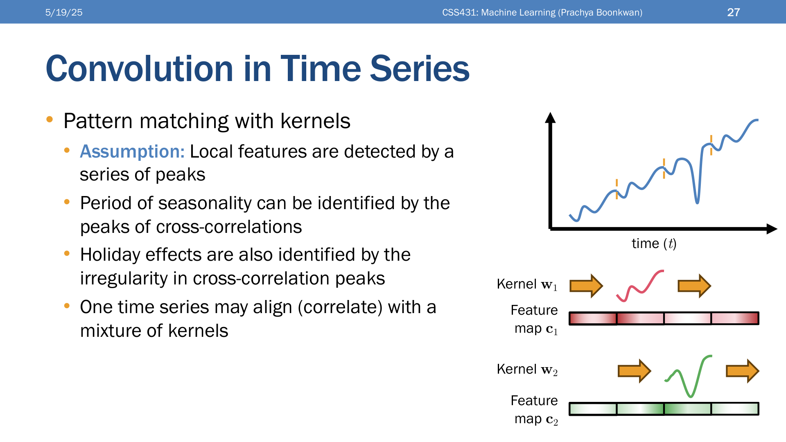

N<br>MSE = [1] e [2]<br>t<br>�<br>N<br>t =1<br>**----- End of picture text -----**<br>

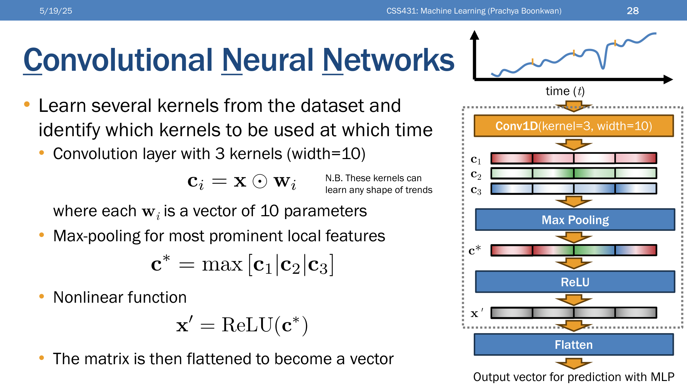


- Estimate parameters _θk_ with MSE of all _et_ with fixed φ _k_ 

**==> picture [480 x 102] intentionally omitted <==**

**----- Start of picture text -----**<br>

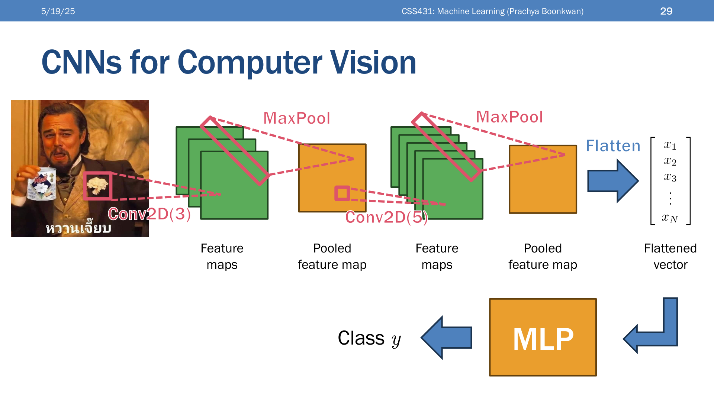

p q<br>= →  <br>et  x [→] t [→] ωkx [→] t↑k εjet↑j<br>� �<br>� k =1 � j =1<br> <br>**----- End of picture text -----**<br>

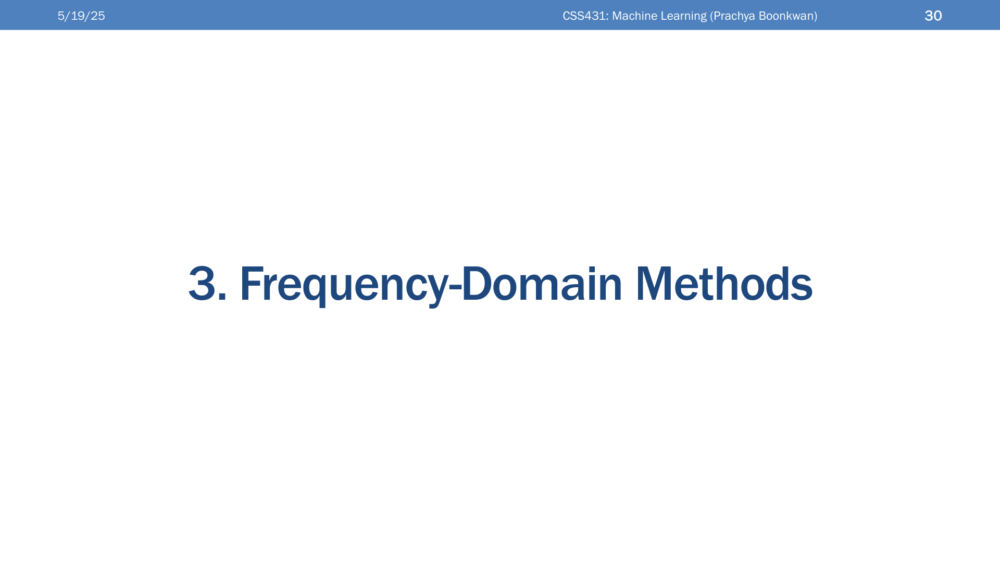


19 


5/19/25 

## Prediction of _d_ ARIMA( _p_ , , _q_ ) 

- Suppose we want to predict future values _xt_ +1 to _xt_ +N 

   - We compute the differences and errors of timesteps _t_ +1 to _t_ + _N_ 

**==> picture [446 x 183] intentionally omitted <==**

- We compute the future values from the differences 

**==> picture [190 x 33] intentionally omitted <==**

20 


5/19/25 

## Incomplete Time Series 

- Interpolation techniques 

• Newton’s interpolation: each _ai_ is computed by divided differences _→ n_ 1 _N_ ( _x_ ) = _a_ 0 + _a_ 1( _x → x_ 0) + _a_ 2( _x → x_ 0)( _x → x_ 1) + _. . ._ + _an_ ( _x → xk_ ) � _k_ =0 

- Cubic spline interpolation: cubic curve 

_Si_ ( _x_ ) = _ai_ + _bi_ ( _x → xi_ ) + _ci_ ( _x → xi_ )[2] + _di_ ( _x → xi_ )[3] 

- Chebyshev’s interpolation: sinusoidal seasonality 

**==> picture [328 x 53] intentionally omitted <==**

**==> picture [669 x 93] intentionally omitted <==**

21 


5/19/25 

## Evaluation of Prediction Models 

- Mean absolute error (MAE): average absolute difference between prediction and gold standard 

- Root mean squared error (RMSE): square root of mean squared difference between prediction and gold standard 

- Mean absolute percentage error (MAPE): average percentage difference between prediction and gold standard (w.r.t. gold standard) 

- Forecast bias: average bias (prediction – gold standard) 

**==> picture [242 x 260] intentionally omitted <==**

**----- Start of picture text -----**<br>

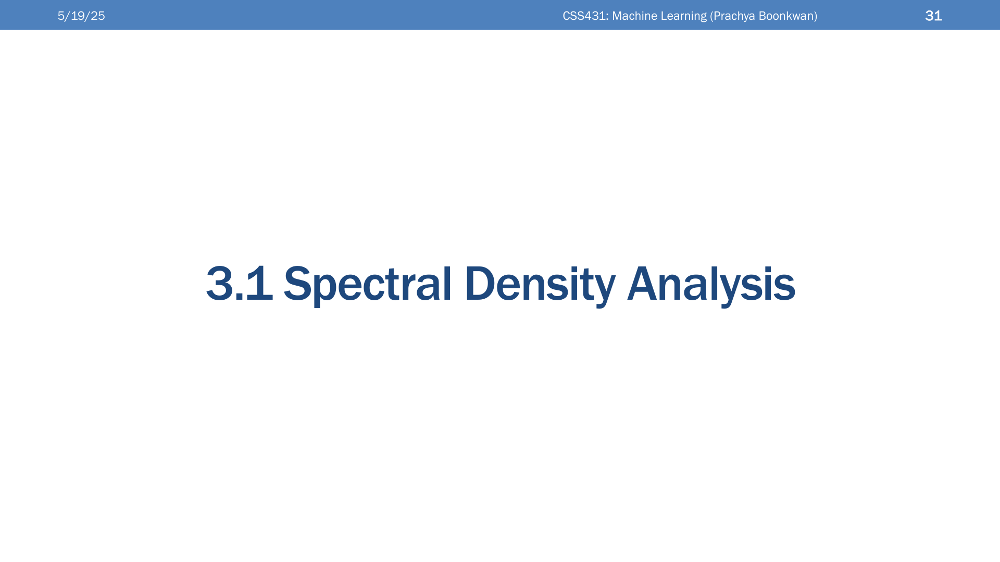

N<br>MAE = [1] ˆ<br>|yk → yk|<br>�<br>N<br>k =1<br>�<br>� N<br>1 ˆ<br>�<br>RMSE = � ( yk → yk ) [2]<br>N<br>k =1<br>�<br>N ˆ<br>yk → yk<br>MAPE = [1]<br>�<br>N<br>���� yk ����<br>k =1<br>**----- End of picture text -----**<br>

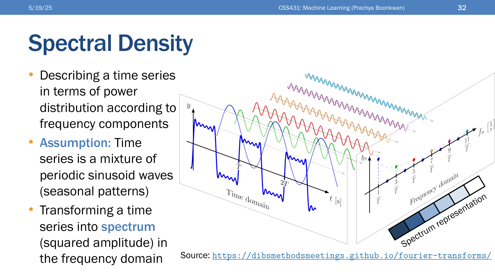


**==> picture [220 x 65] intentionally omitted <==**

**----- Start of picture text -----**<br>

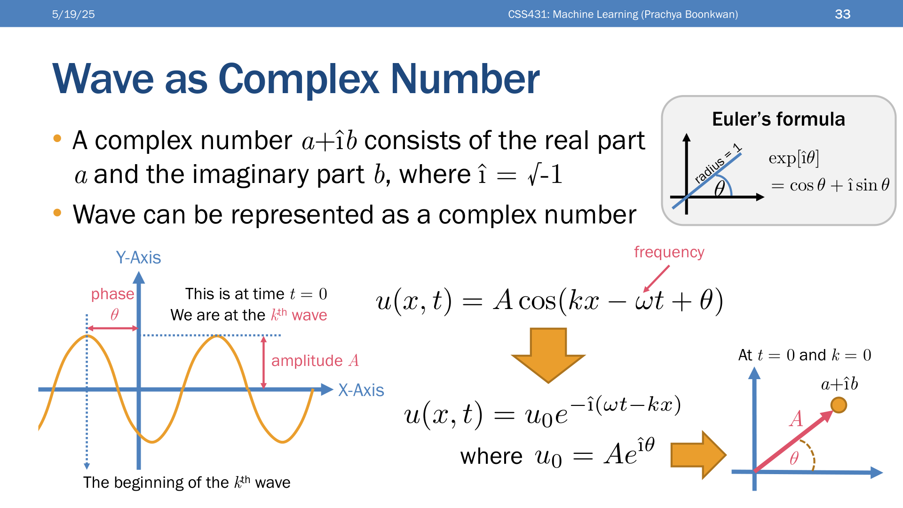

N<br>ˆ<br>bias = [1]<br>( yk → yk )<br>�<br>N<br>k =1<br>**----- End of picture text -----**<br>

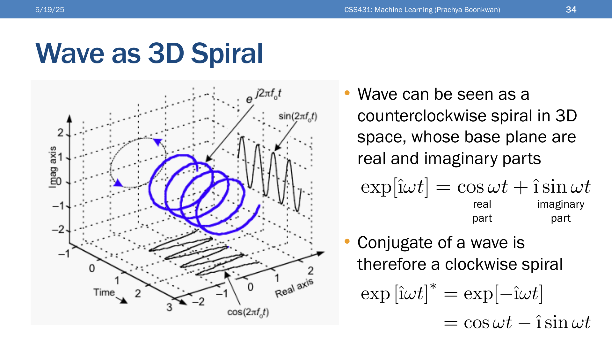


22 


5/19/25 

# 2.2 Convolutional Analysis and CNNs 

23 


5/19/25 

## Convolution ∗ 

- Combining two functions to produce a third one that represents how one amplifies the other in each step of their overlapping 

   - Continuous convolution 

**==> picture [344 x 54] intentionally omitted <==**

- Discrete convolution 

**==> picture [312 x 64] intentionally omitted <==**

- where _f_ is an input signal and _w_ is a kernel (i.e. pattern filter) 

**==> picture [146 x 13] intentionally omitted <==**

**----- Start of picture text -----**<br>

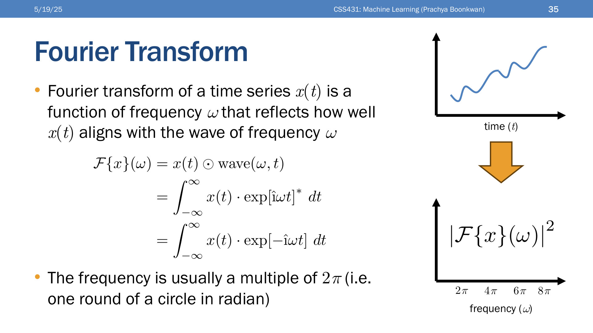

This is our kernel  w<br>**----- End of picture text -----**<br>

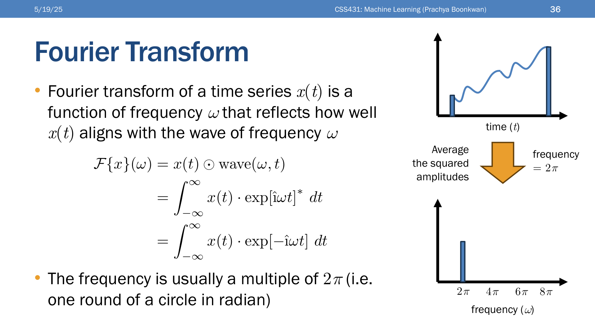


Kernel _w_ Input _f_ (flipped) (as is) _t_ =0 _t_ =1 _t_ =2 _t_ =3 

**==> picture [177 x 16] intentionally omitted <==**

**----- Start of picture text -----**<br>

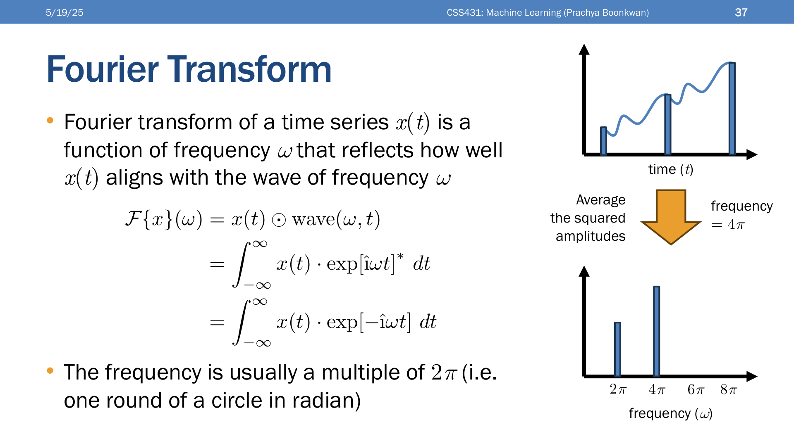

Two waves are colliding<br>**----- End of picture text -----**<br>

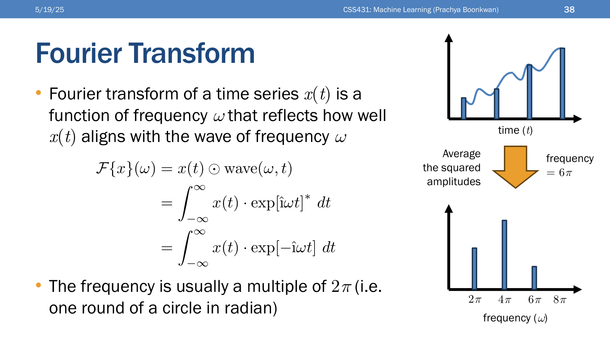


24 


5/19/25 

## Cross-Correlation ⊙ 

## • The intuitive counterpart of convolution, where the kernel function is not flipped 

* is the complex conjugate e.g. (3 + 4î)* = 3 – 4î _→_ [ _f → w_ ]( _t_ ) = _f_ ( _ω_ ) _· w_ ( _t_ + _ω_ ) _[↓] dω_ � _↑→_ 

## • Continuous cross-correlation 

## • Discrete cross-correlation 

**==> picture [337 x 65] intentionally omitted <==**

## • We will say ‘convolution’ to refer to crosscorrelation for ease of understanding 

_t_ =0 

_t_ =1 

_t_ =2 

_t_ =3 

This is our kernel _w_ 

Kernel _w_ Input _f_ (as is) (as is) 

**==> picture [113 x 286] intentionally omitted <==**

Similarity of two waves 

25 


5/19/25 

## Convolutional Filtering 

**==> picture [714 x 385] intentionally omitted <==**

Find (kernel) 

26 


5/19/25 

## Convolutional Filtering 

**==> picture [724 x 396] intentionally omitted <==**

Find (kernel) 

- Matched areas are amplified 

- Objects are detected via convolution 

• We have extracted the local features 

27 


5/19/25 

## Convolution in Time Series 

- Pattern matching with kernels 

   - Assumption: Local features are detected by a series of peaks 

   - Period of seasonality can be identified by the peaks of cross-correlations 

   - Holiday effects are also identified by the irregularity in cross-correlation peaks 

   - One time series may align (correlate) with a mixture of kernels 

**==> picture [285 x 151] intentionally omitted <==**

**==> picture [56 x 16] intentionally omitted <==**

**----- Start of picture text -----**<br>

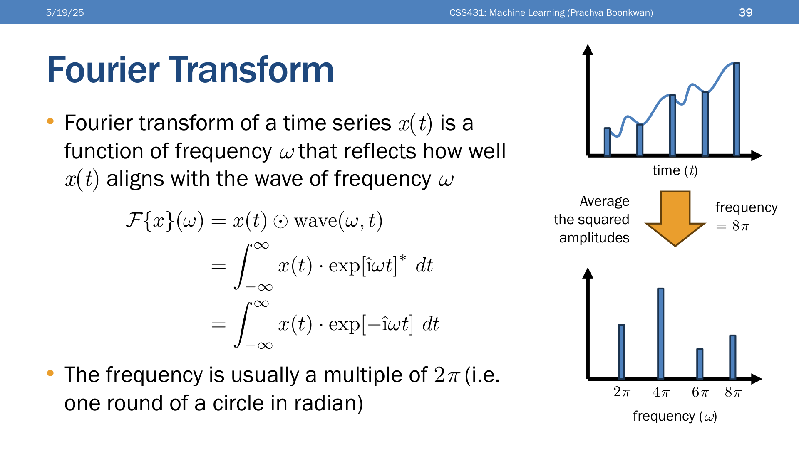

time ( t )<br>**----- End of picture text -----**<br>

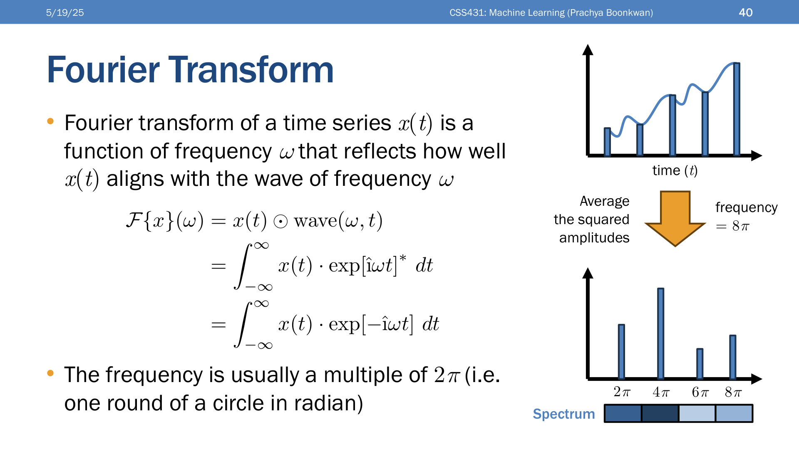


**==> picture [76 x 70] intentionally omitted <==**

**----- Start of picture text -----**<br>

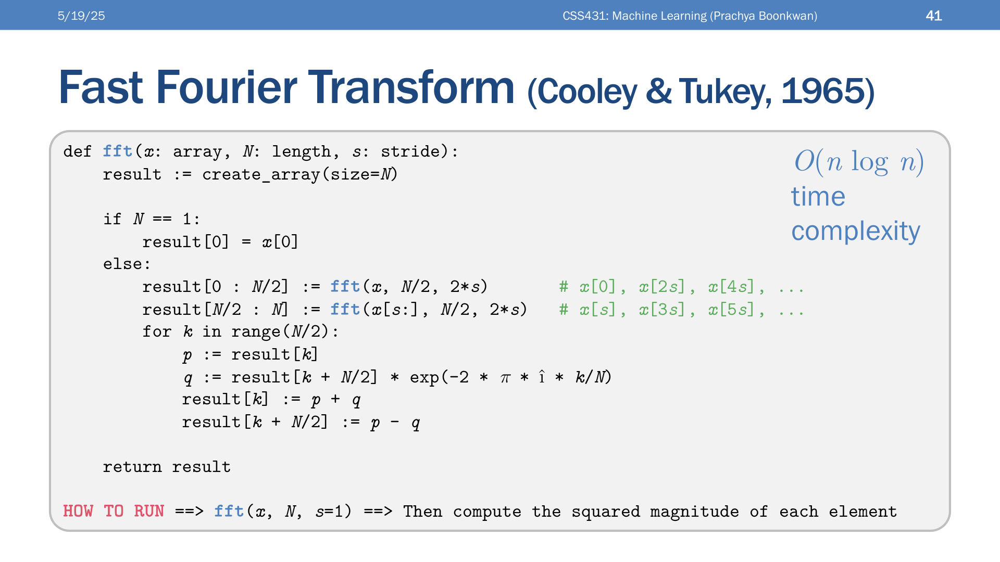

Kernel  w 1<br>Feature<br>map  c 1<br>**----- End of picture text -----**<br>

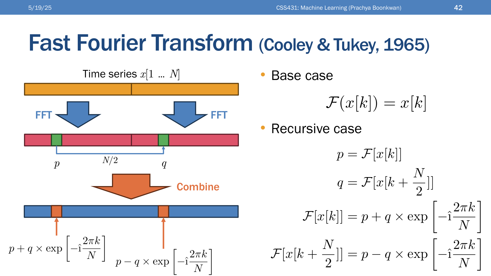


**==> picture [59 x 16] intentionally omitted <==**

**==> picture [58 x 16] intentionally omitted <==**

**==> picture [59 x 16] intentionally omitted <==**

**==> picture [59 x 15] intentionally omitted <==**

**==> picture [76 x 76] intentionally omitted <==**

**----- Start of picture text -----**<br>

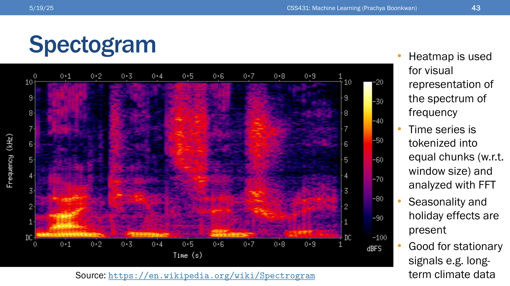

Kernel  w 2<br>Feature<br>map  c 2<br>**----- End of picture text -----**<br>

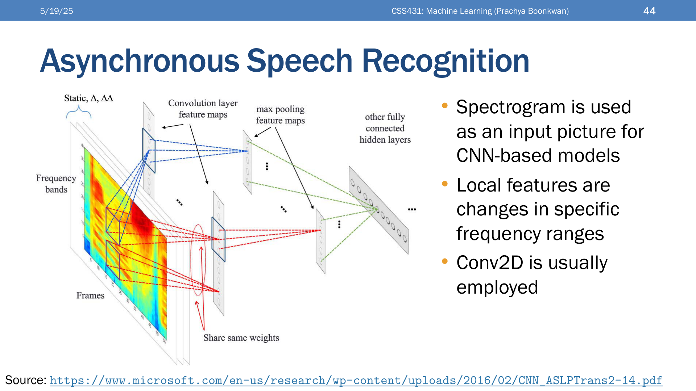


**==> picture [59 x 15] intentionally omitted <==**

**==> picture [58 x 15] intentionally omitted <==**

**==> picture [59 x 16] intentionally omitted <==**

**==> picture [59 x 16] intentionally omitted <==**

28 


5/19/25 

## Convolutional Neural Networks 

- Learn several kernels from the dataset and identify which kernels to be used at which time 

   - Convolution layer with 3 kernels (width=10) 

N.B. These kernels can **c** _i_ = **x** _→_ **w** _i_ learn any shape of trends 

where each **w** _i_ is a vector of 10 parameters 

- Max-pooling for most prominent local features **c** _[→]_ **c c c** = max [ 1 _|_ 2 _|_ 3] 

- Nonlinear function 

**x** _[→]_ = ReLU( **c** _[↑]_ ) 

- The matrix is then flattened to become a vector 

**==> picture [285 x 76] intentionally omitted <==**

**==> picture [289 x 416] intentionally omitted <==**

**----- Start of picture text -----**<br>

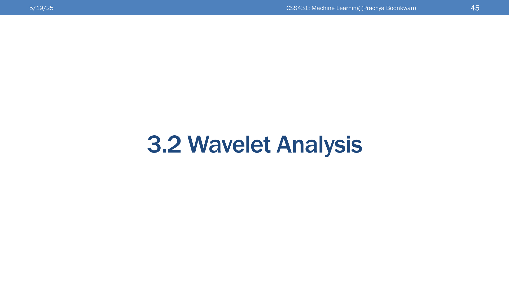

time ( t )<br>Conv1D(kernel=3, width=10)<br>c 1<br>c<br>2<br>c<br>3<br>Max Pooling<br>*<br>c<br>ReLU<br>'<br>x<br>Flatten<br>Output vector for prediction with MLP<br>**----- End of picture text -----**<br>

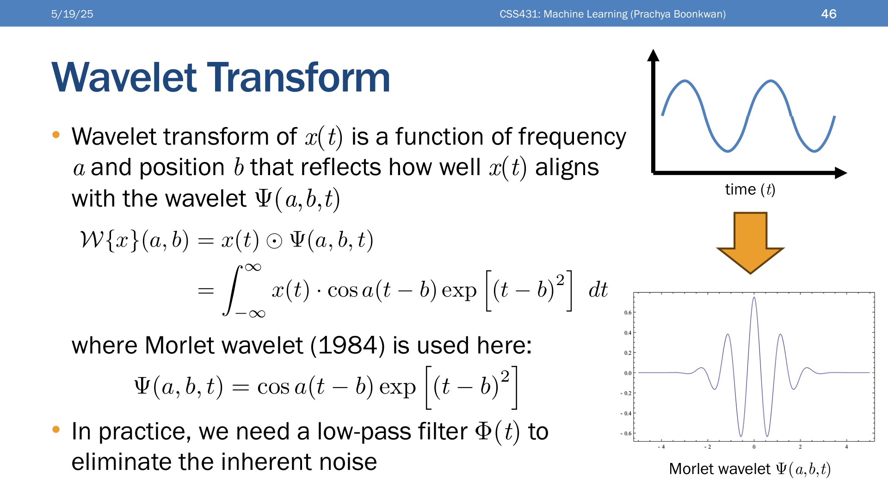


29 


5/19/25 

## CNNs for Computer Vision 

**==> picture [793 x 335] intentionally omitted <==**

**----- Start of picture text -----**<br>

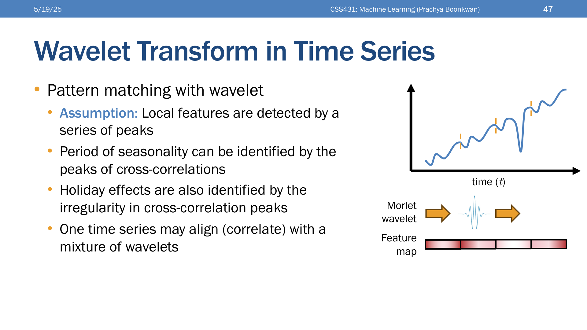

x 1<br> <br>x 2<br>x 3<br>...<br>xN<br> <br>Feature Pooled Feature Pooled Flattened<br>maps feature map maps feature map vector<br>Class<br>y MLP<br>**----- End of picture text -----**<br>

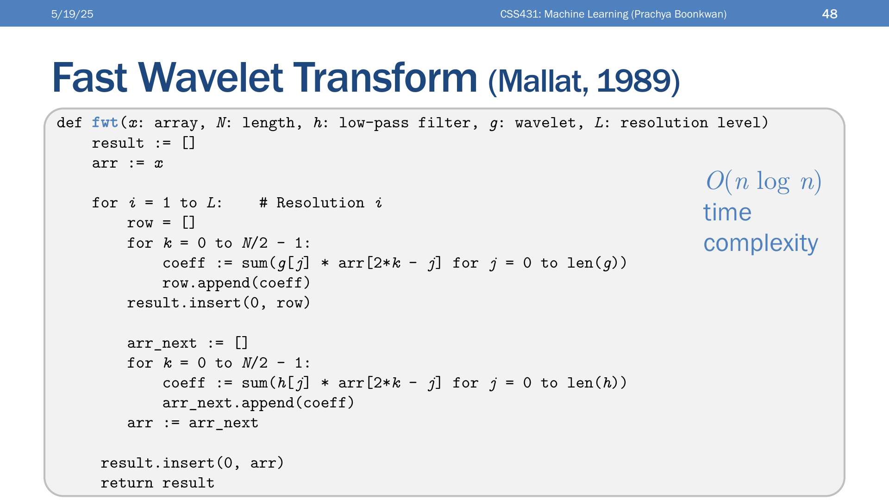


30 


5/19/25 

# 3. Frequency-Domain Methods 

31 


5/19/25 

# 3.1 Spectral Density Analysis 

32 


5/19/25 

## Spectral Density 

- Describing a time series 

in terms of power distribution according to frequency components 

- Assumption: Time series is a mixture of periodic sinusoid waves (seasonal patterns) 

- Transforming a time series into spectrum (squared amplitude) in the frequency domain 

**==> picture [193 x 141] intentionally omitted <==**

**----- Start of picture text -----**<br>

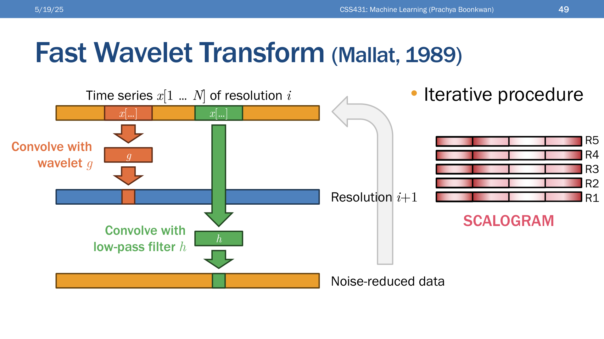

Spectrum representation<br>**----- End of picture text -----**<br>

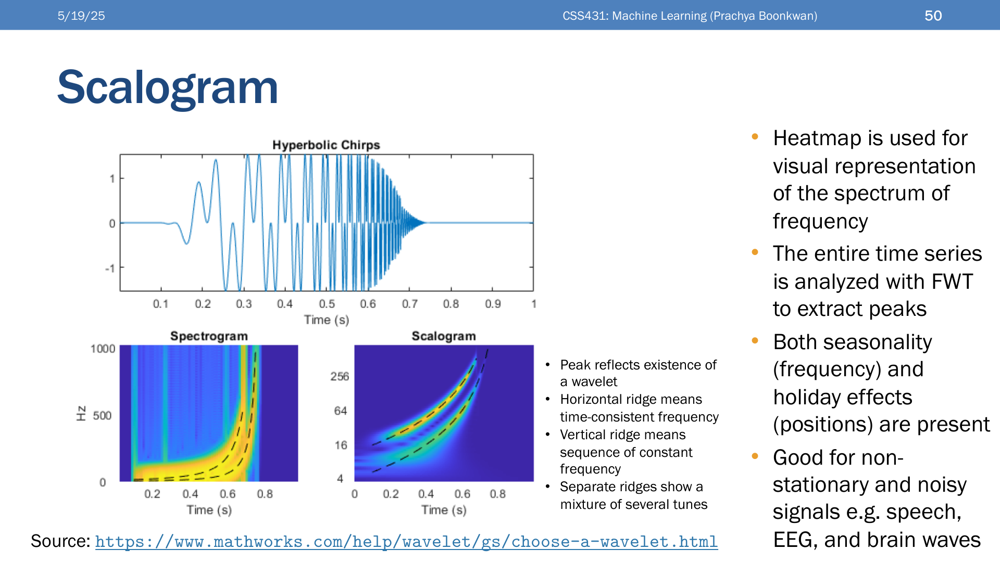


Source: `https://dibsmethodsmeetings.github.io/fourier-transforms/` 

33 


5/19/25 

## Wave as Complex Number 

**==> picture [1071 x 420] intentionally omitted <==**

**----- Start of picture text -----**<br>

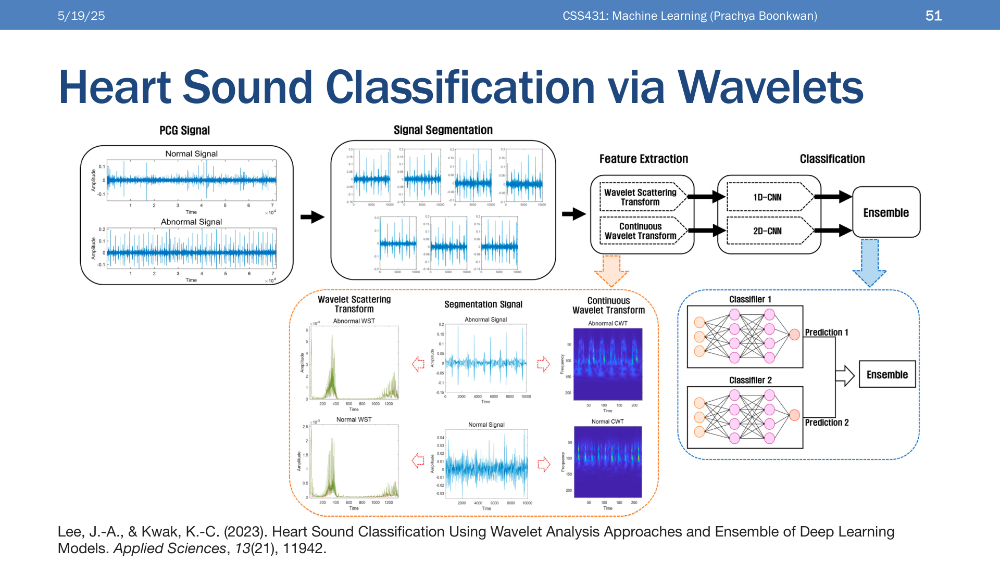

Euler’s formula<br>• A complex number  a +î b  consists of the real part<br>exp[ˆı ω ]<br>a  and the imaginary part  b , where î = √-1 θ = cos  ω  +ˆı sin  ω<br>•<br>Wave can be represented as a complex number<br>frequency<br>Y-Axis<br>phase This is at time  t  = 0 u ( x, t ) =  A  cos( kx − !t  +  ✓ )<br>θ We are at the  k [th]  wave<br>At  t  = 0 and  k  = 0<br>amplitude  A<br>a +î b<br>X-Axis<br>u  u e [→] [ˆı(] [ωt][→][kx] [)]<br>( x, t ) = 0 A<br>where u =  Ae [ˆı] [ω] θ<br>0<br>k [th]  wave<br>The beginning of the<br>radius = 1<br>**----- End of picture text -----**<br>

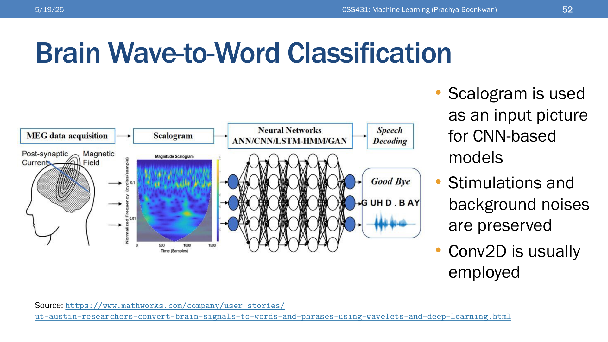


34 


5/19/25 

## Wave as 3D Spiral 

**==> picture [484 x 384] intentionally omitted <==**

- Wave can be seen as a 

counterclockwise spiral in 3D space, whose base plane are real and imaginary parts 

exp[ˆı _ωt_ ] = cos _ωt_ +ˆı sin _ωt_ real imaginary part part • Conjugate of a wave is therefore a clockwise spiral _→ ωt_ ˆı _ωt_ exp [ˆı ] _[→]_ = exp[ ] 

- = cos _ωt →_ ˆı sin _ωt_ 

35 


5/19/25 

## Fourier Transform 

- Fourier transform of a time series _x_ ( _t_ ) is a function of frequency ω that reflects how well _x t_ ω ( ) aligns with the wave of frequency 

**==> picture [312 x 26] intentionally omitted <==**

_→_ = _x_ ( _t_ ) _·_ exp[ˆı _ωt_ ] _[↓] dt_ � _↑→ →_ = _x_ ( _t_ ) _·_ exp[ _↑_ ˆı _ωt_ ] _dt_ � _↑→_ 

- 2π 

- The frequency is usually a multiple of (i.e. one round of a circle in radian) 

**==> picture [218 x 142] intentionally omitted <==**

## time ( _t_ ) 

**==> picture [70 x 67] intentionally omitted <==**

**==> picture [218 x 157] intentionally omitted <==**

**----- Start of picture text -----**<br>

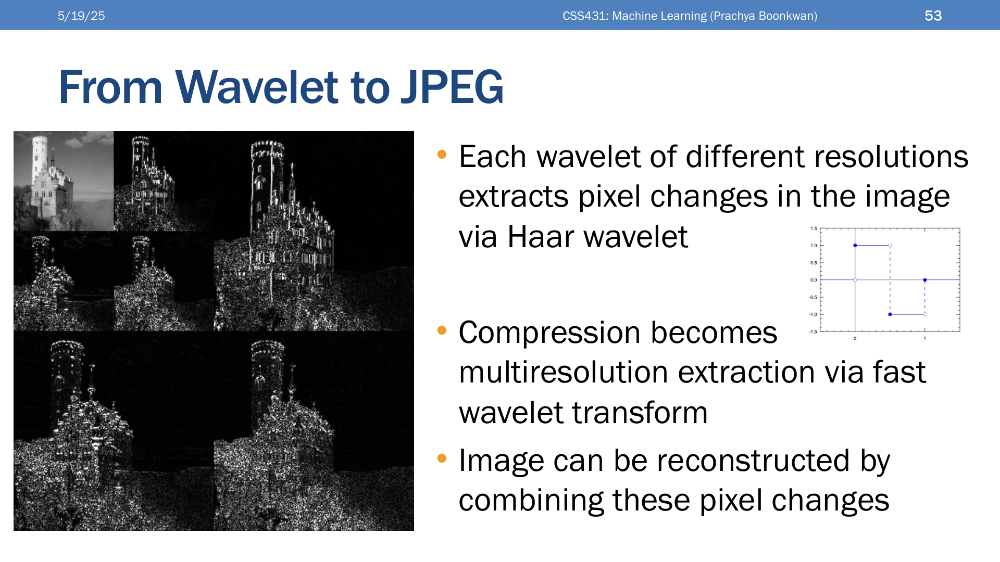

x ω<br>|F{ } ( ) | [2]<br>2π 4π 6π 8π<br>**----- End of picture text -----**<br>

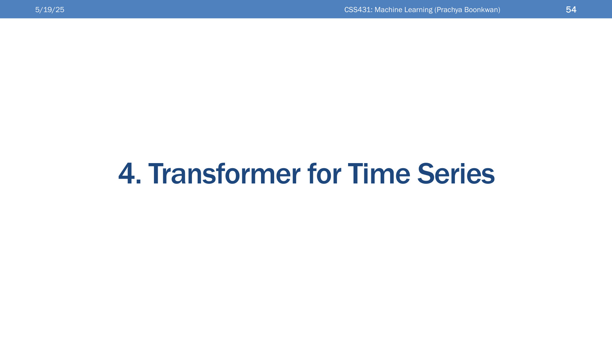


**==> picture [102 x 17] intentionally omitted <==**

**----- Start of picture text -----**<br>

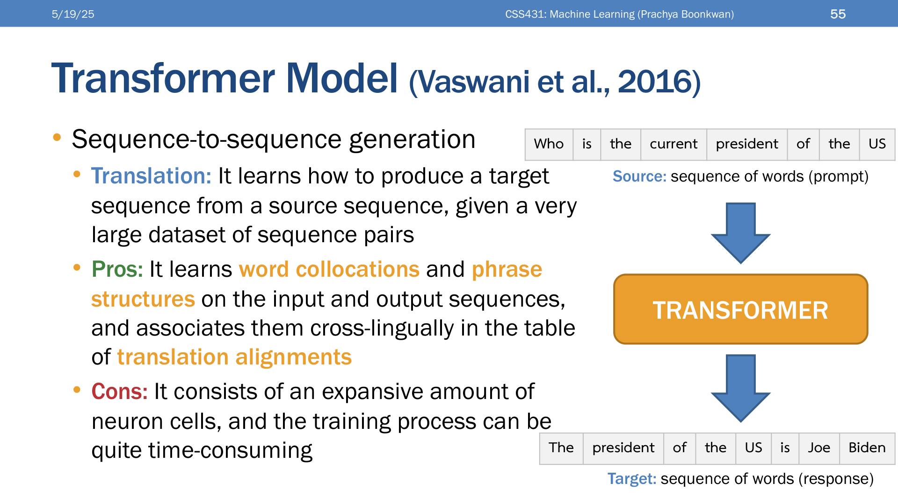

frequency (ω)<br>**----- End of picture text -----**<br>

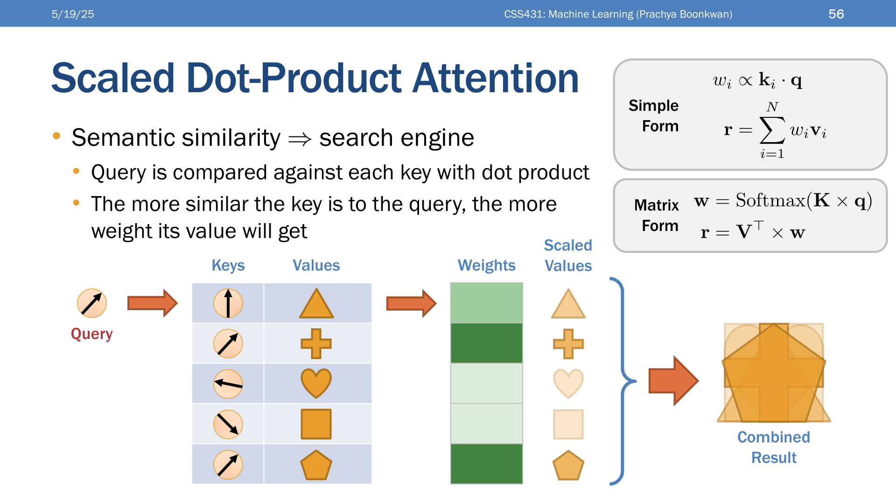


36 


5/19/25 

## Fourier Transform 

- Fourier transform of a time series _x_ ( _t_ ) is a function of frequency ω that reflects how well _x t_ ω ( ) aligns with the wave of frequency 

**==> picture [312 x 26] intentionally omitted <==**

_→_ = _x_ ( _t_ ) _·_ exp[ˆı _ωt_ ] _[↓] dt_ � _↑→ →_ = _x_ ( _t_ ) _·_ exp[ _↑_ ˆı _ωt_ ] _dt_ � _↑→_ 

- 2π 

- The frequency is usually a multiple of (i.e. one round of a circle in radian) 

**==> picture [218 x 142] intentionally omitted <==**

**==> picture [56 x 16] intentionally omitted <==**

**----- Start of picture text -----**<br>

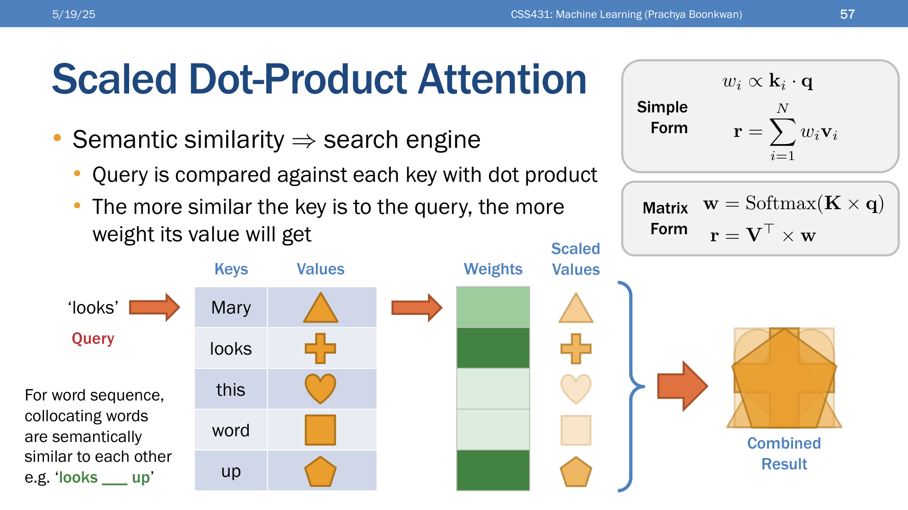

time ( t )<br>**----- End of picture text -----**<br>

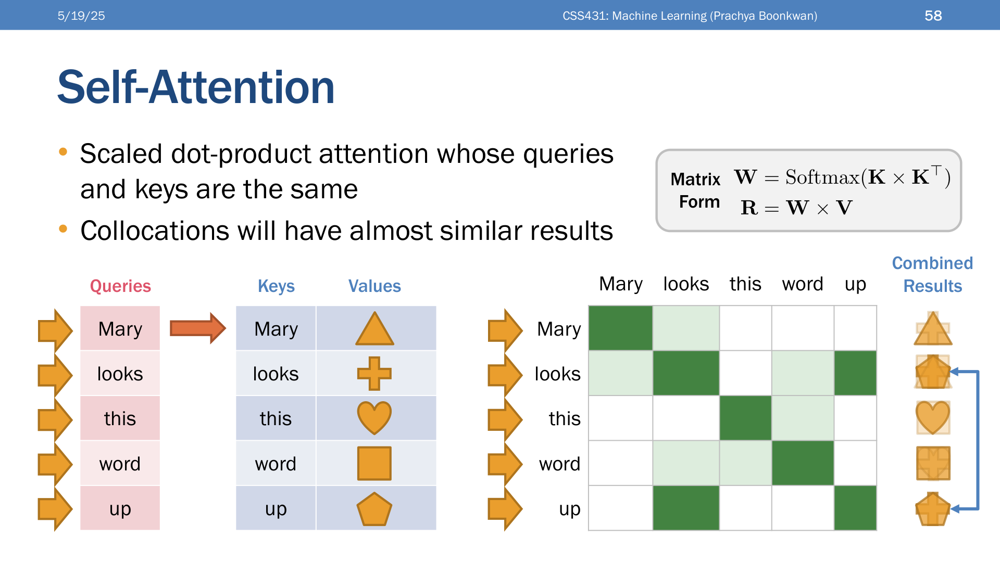


**==> picture [270 x 67] intentionally omitted <==**

**----- Start of picture text -----**<br>

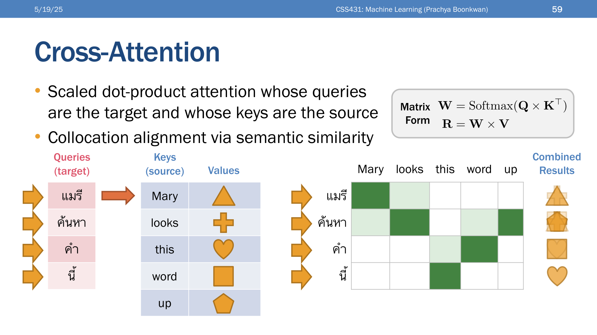

Average<br>frequency<br>the squared<br>= 2π<br>amplitudes<br>**----- End of picture text -----**<br>

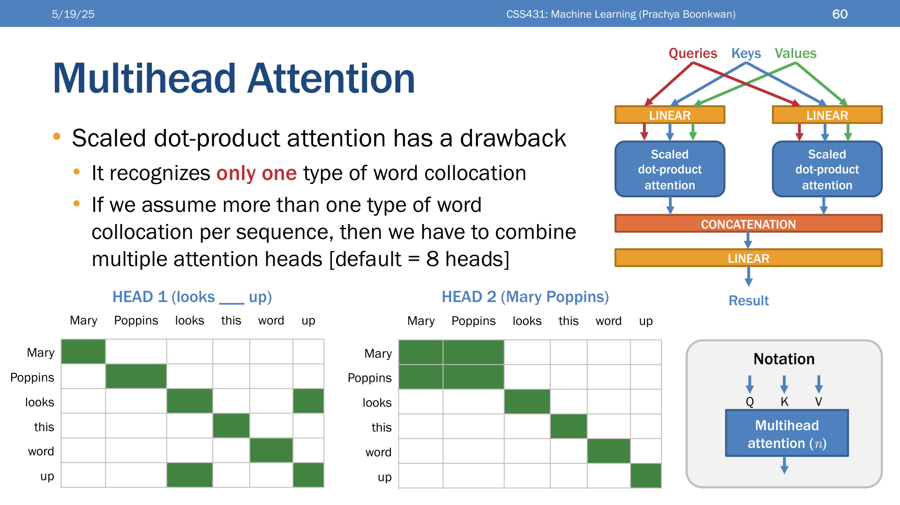


**==> picture [218 x 142] intentionally omitted <==**

**==> picture [156 x 14] intentionally omitted <==**

**----- Start of picture text -----**<br>

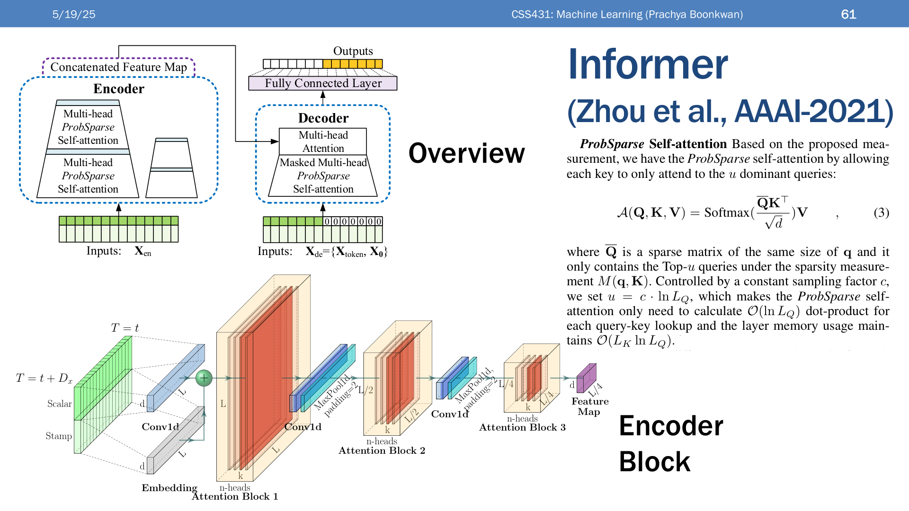

2π 4π 6π 8π<br>**----- End of picture text -----**<br>

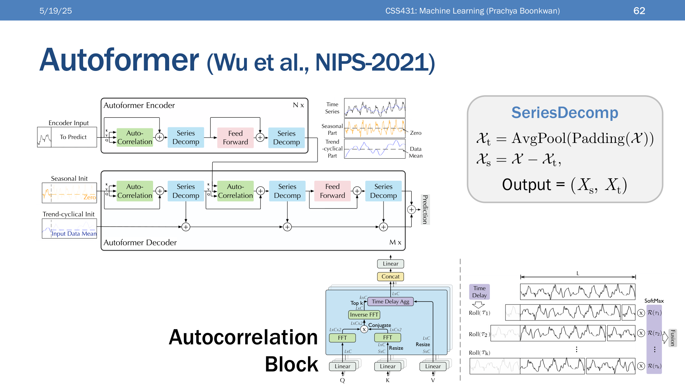


**==> picture [102 x 17] intentionally omitted <==**

**----- Start of picture text -----**<br>

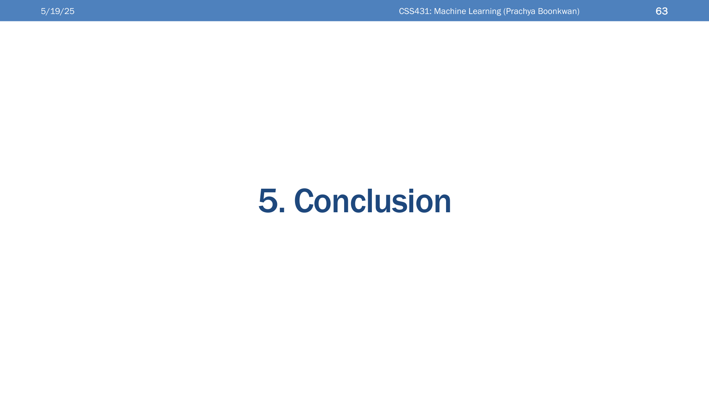

frequency (ω)<br>**----- End of picture text -----**<br>


37 


5/19/25 

## Fourier Transform 

- Fourier transform of a time series _x_ ( _t_ ) is a function of frequency ω that reflects how well _x t_ ω ( ) aligns with the wave of frequency 

**==> picture [312 x 26] intentionally omitted <==**

_→_ = _x_ ( _t_ ) _·_ exp[ˆı _ωt_ ] _[↓] dt_ � _↑→ →_ = _x_ ( _t_ ) _·_ exp[ _↑_ ˆı _ωt_ ] _dt_ � _↑→_ 

- 2π 

- The frequency is usually a multiple of (i.e. one round of a circle in radian) 

**==> picture [218 x 142] intentionally omitted <==**

**==> picture [56 x 16] intentionally omitted <==**

**----- Start of picture text -----**<br>

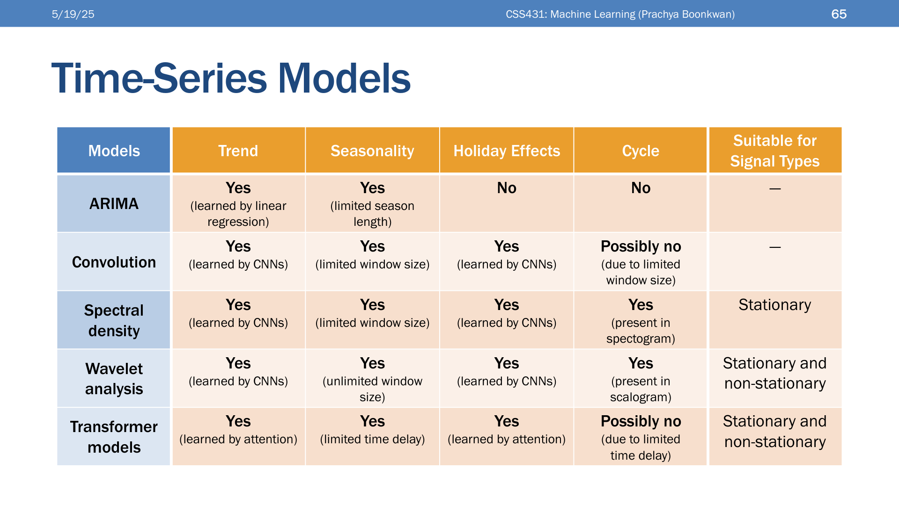

time ( t )<br>**----- End of picture text -----**<br>

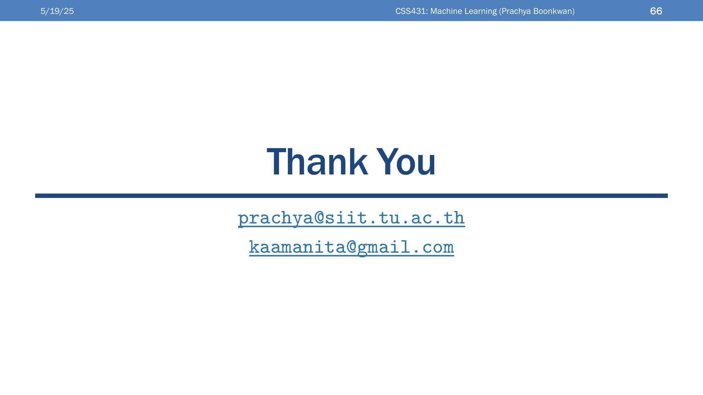


**==> picture [270 x 248] intentionally omitted <==**

**----- Start of picture text -----**<br>


Average<br>frequency<br>the squared<br>= 4π<br>amplitudes<br>2π 4π 6π 8π<br>**----- End of picture text -----**<br>


**==> picture [102 x 17] intentionally omitted <==**

**----- Start of picture text -----**<br>


frequency (ω)<br>**----- End of picture text -----**<br>


38 


5/19/25 

## Fourier Transform 

- Fourier transform of a time series _x_ ( _t_ ) is a function of frequency ω that reflects how well _x t_ ω ( ) aligns with the wave of frequency 

**==> picture [312 x 26] intentionally omitted <==**

**==> picture [276 x 129] intentionally omitted <==**

- 2π 

- The frequency is usually a multiple of (i.e. one round of a circle in radian) 

**==> picture [218 x 142] intentionally omitted <==**

**==> picture [56 x 16] intentionally omitted <==**

**----- Start of picture text -----**<br>


time ( t )<br>**----- End of picture text -----**<br>


**==> picture [270 x 248] intentionally omitted <==**

**----- Start of picture text -----**<br>


Average<br>frequency<br>the squared<br>= 6π<br>amplitudes<br>2π 4π 6π 8π<br>**----- End of picture text -----**<br>


**==> picture [102 x 17] intentionally omitted <==**

**----- Start of picture text -----**<br>


frequency (ω)<br>**----- End of picture text -----**<br>


39 


5/19/25 

## Fourier Transform 

- Fourier transform of a time series _x_ ( _t_ ) is a function of frequency ω that reflects how well _x t_ ω ( ) aligns with the wave of frequency 

**==> picture [312 x 26] intentionally omitted <==**

**==> picture [276 x 129] intentionally omitted <==**

- 2π 

- The frequency is usually a multiple of (i.e. one round of a circle in radian) 

**==> picture [218 x 142] intentionally omitted <==**

**==> picture [56 x 16] intentionally omitted <==**

**----- Start of picture text -----**<br>


time ( t )<br>**----- End of picture text -----**<br>


**==> picture [270 x 248] intentionally omitted <==**

**----- Start of picture text -----**<br>


Average<br>frequency<br>the squared<br>= 8π<br>amplitudes<br>2π 4π 6π 8π<br>**----- End of picture text -----**<br>


**==> picture [102 x 17] intentionally omitted <==**

**----- Start of picture text -----**<br>


frequency (ω)<br>**----- End of picture text -----**<br>


40 


5/19/25 

## Fourier Transform 

- Fourier transform of a time series _x_ ( _t_ ) is a function of frequency ω that reflects how well _x t_ ω ( ) aligns with the wave of frequency 

**==> picture [312 x 26] intentionally omitted <==**

_→_ = _x_ ( _t_ ) _·_ exp[ˆı _ωt_ ] _[↓] dt_ � _↑→ →_ = _x_ ( _t_ ) _·_ exp[ _↑_ ˆı _ωt_ ] _dt_ � _↑→_ 

- 2π 

- The frequency is usually a multiple of (i.e. one round of a circle in radian) 

**==> picture [218 x 142] intentionally omitted <==**

**==> picture [56 x 16] intentionally omitted <==**

**----- Start of picture text -----**<br>


time ( t )<br>**----- End of picture text -----**<br>


**==> picture [270 x 67] intentionally omitted <==**

**----- Start of picture text -----**<br>


Average<br>frequency<br>the squared<br>= 8π<br>amplitudes<br>**----- End of picture text -----**<br>


**==> picture [218 x 142] intentionally omitted <==**

**==> picture [156 x 14] intentionally omitted <==**

**----- Start of picture text -----**<br>


2π 4π 6π 8π<br>**----- End of picture text -----**<br>


**==> picture [76 x 16] intentionally omitted <==**

**----- Start of picture text -----**<br>


Spectrum<br>**----- End of picture text -----**<br>


41 


5/19/25 

## Fast Fourier Transform (Cooley & Tukey, 1965) 

```
def fft(x: array, N: length, s: stride):
    result := create_array(size=N)
```

```
    if N == 1:
        result[0] = x[0]
    else:
```

_O_ ( _n_ log _n_ ) time complexity 

`result[0 :` _`N`_ `/2] := fft (` _`x`_ `,` _`N`_ `/2, 2*` _`s`_ `)       #` _`x`_ `[0],` _`x`_ `[2` _`s`_ `],` _`x`_ `[4` _`s`_ `], ... result[` _`N`_ `/2 :` _`N`_ `] := fft (` _`x`_ `[` _`s`_ `:],` _`N`_ `/2, 2*` _`s`_ `)   #` _`x`_ `[` _`s`_ `],` _`x`_ `[3` _`s`_ `],` _`x`_ `[5` _`s`_ `], ... for` _`k`_ `in range(` _`N`_ `/2):` _`p`_ `:= result[` _`k`_ `]` _`q`_ `:= result[` _`k`_ `+` _`N`_ `/2] * exp(-2 *` π `*` î `*` _`k`_ `/` _`N`_ `) result[` _`k`_ `] :=` _`p`_ `+` _`q`_ `result[` _`k`_ `+` _`N`_ `/2] :=` _`p`_ `-` _`q`_ 

```
    return result
```

> `HOW TO RUN ==> fft (` _`x`_ `,` _`N`_ `,` _`s`_ `=1) ==> Then compute the squared magnitude of each element` 

42 


5/19/25 

## Fast Fourier Transform (Cooley & Tukey, 1965) 

**==> picture [930 x 403] intentionally omitted <==**

**----- Start of picture text -----**<br>


Time series  x [1 …  N ] • Base case<br>F ( x [ k ]) =  x [ k ]<br>FFT FFT<br>•<br>Recursive case<br> =  F x k<br>p [ [ ]]<br>N /2<br>p q<br>=<br>Combine q  F [ x [ k  + [N]<br>2 []]]<br>↑<br>F [ x [ k ]] =  p  +  q → exp ˆı [2] [ωk]<br>N<br>� �<br>↑<br>p  +  q → exp ˆı [2] [ωk] ↑<br>N F x k  + [N] ˆı [2] [ωk]<br>� �  →  ↑ → ˆı [2] [ωk] [ [<br>p q exp 2 []] =] [ p][ ↑] [q][ →] [exp] N<br>N � �<br>� �<br>**----- End of picture text -----**<br>


43 


5/19/25 

## Spectogram 

**==> picture [741 x 384] intentionally omitted <==**

Source: `https://en.wikipedia.org/wiki/Spectrogram` 

- Heatmap is used for visual representation of the spectrum of frequency 

- Time series is tokenized into equal chunks (w.r.t. window size) and analyzed with FFT 

- Seasonality and holiday effects are present 

- Good for stationary signals e.g. longterm climate data 

44 


5/19/25 

## Asynchronous Speech Recognition 

**==> picture [526 x 377] intentionally omitted <==**

- Spectrogram is used as an input picture for CNN-based models 

- Local features are changes in specific frequency ranges 

- • Conv2D is usually employed 

Source: `https://www.microsoft.com/en-us/research/wp-content/uploads/2016/02/CNN_ASLPTrans2-14.pdf` 

45 


5/19/25 

3.2 Wavelet Analysis 

46 


5/19/25 

**==> picture [218 x 142] intentionally omitted <==**

## Wavelet Transform 

- Wavelet transform of _x_ ( _t_ ) is a function of frequency _a_ and position _b_ that reflects how well _x_ ( _t_ ) aligns with the wavelet Ψ _a b t_ ( , , ) 

**==> picture [56 x 16] intentionally omitted <==**

**----- Start of picture text -----**<br>


time ( t )<br>**----- End of picture text -----**<br>


**==> picture [70 x 67] intentionally omitted <==**

**==> picture [582 x 196] intentionally omitted <==**

**==> picture [278 x 172] intentionally omitted <==**

- In practice, we need a low-pass filter Φ( _t_ ) to eliminate the inherent noise 

**==> picture [177 x 19] intentionally omitted <==**

**----- Start of picture text -----**<br>


Morlet wavelet Ψ a b t<br>( , , )<br>**----- End of picture text -----**<br>


47 


5/19/25 

## Wavelet Transform in Time Series 

- Pattern matching with wavelet 

   - Assumption: Local features are detected by a series of peaks 

   - Period of seasonality can be identified by the peaks of cross-correlations 

   - Holiday effects are also identified by the irregularity in cross-correlation peaks 

   - One time series may align (correlate) with a mixture of wavelets 

**==> picture [285 x 151] intentionally omitted <==**

**==> picture [56 x 16] intentionally omitted <==**

**----- Start of picture text -----**<br>


time ( t )<br>**----- End of picture text -----**<br>


**==> picture [55 x 57] intentionally omitted <==**

**==> picture [59 x 92] intentionally omitted <==**

**----- Start of picture text -----**<br>


Morlet<br>wavelet<br>Feature<br>map<br>**----- End of picture text -----**<br>


**==> picture [59 x 15] intentionally omitted <==**

**==> picture [58 x 16] intentionally omitted <==**

**==> picture [59 x 16] intentionally omitted <==**

**==> picture [59 x 16] intentionally omitted <==**

48 


5/19/25 

## Fast Wavelet Transform (Mallat, 1989) 

```
def fwt(x: array, N: length, h: low-pass filter, g: wavelet, L: resolution level)
    result := []
```

```
    arr := x
```

```
    for i = 1 to L:    # Resolution i
        row = []
        for k = 0 to N/2 – 1:
            coeff := sum(g[j] * arr[2*k - j] for j = 0 to len(g))
            row.append(coeff)
        result.insert(0, row)
        arr_next := []
        for k = 0 to N/2 – 1:
            coeff := sum(h[j] * arr[2*k - j] for j = 0 to len(h))
            arr_next.append(coeff)
        arr := arr_next
```

_O_ ( _n_ log _n_ ) time complexity 

```
     result.insert(0, arr)
     return result
```

49 


5/19/25 

## Fast Wavelet Transform (Mallat, 1989) 

• Iterative procedure Iterative procedure 

**==> picture [936 x 317] intentionally omitted <==**

**----- Start of picture text -----**<br>


Time series  x [1 …  N ] of resolution  i • Iterative procedure<br>x x<br>[…] […]<br>R5<br>Convolve with<br>R4<br>g<br>wavelet<br>g<br>R3<br>R2<br>Resolution  i +1 R1<br>SCALOGRAM<br>Convolve with<br>h<br>low-pass filter  h<br>Noise-reduced data<br>**----- End of picture text -----**<br>


50 


5/19/25 

## Scalogram 

   - Heatmap is used for visual representation of the spectrum of frequency 

   - The entire time series is analyzed with FWT to extract peaks 

- Peak reflects existence of a wavelet 

- Horizontal ridge means time-consistent frequency 

- Vertical ridge means sequence of constant frequency 

- Separate ridges show a mixture of several tunes 

Source: `https://www.mathworks.com/help/wavelet/gs/choose-a-wavelet.html` 

- Both seasonality (frequency) and holiday effects (positions) are present 

- Good for nonstationary and noisy signals e.g. speech, EEG, and brain waves 

51 


5/19/25 

## Heart Sound Classification via Wavelets 

**==> picture [816 x 384] intentionally omitted <==**

Lee, J.-A., & Kwak, K.-C. (2023). Heart Sound Classification Using Wavelet Analysis Approaches and Ensemble of Deep Learning Models. _Applied Sciences_ , _13_ (21), 11942. 

52 


5/19/25 

## Brain Wave-to-Word Classification 

**==> picture [650 x 208] intentionally omitted <==**

- Scalogram is used as an input picture for CNN-based models 

- Stimulations and background noises are preserved 

- Conv2D is usually employed 

Source: `https://www.mathworks.com/company/user_stories/` 

```
ut-austin-researchers-convert-brain-signals-to-words-and-phrases-using-wavelets-and-deep-learning.html
```

53 


5/19/25 

## From Wavelet to JPEG 

**==> picture [385 x 384] intentionally omitted <==**

• Each wavelet of different resolutions extracts pixel changes in the image via Haar wavelet 

- Compression becomes multiresolution extraction via fast wavelet transform 

- Image can be reconstructed by combining these pixel changes 

54 


5/19/25 

# 4. Transformer for Time Series 

55 


5/19/25 

## Transformer Model (Vaswani et al., 2016) 

- Sequence-to-sequence generation 

**Who is the current president of the US** 

- Translation: It learns how to produce a target sequence from a source sequence, given a very large dataset of sequence pairs 

Source: sequence of words (prompt) 

**==> picture [60 x 64] intentionally omitted <==**

- Pros: It learns word collocations and phrase structures on the input and output sequences, and associates them cross-lingually in the table of translation alignments 

TRANSFORMER 

**==> picture [60 x 72] intentionally omitted <==**

- Cons: It consists of an expansive amount of e 

- neuron cells, and the training process can b quite time-consuming 

**The president of the US is Joe Biden** 

Target: sequence of words (response) 

56 


5/19/25 

## Scaled Dot-Product Attention 

- ⇒ 

- Semantic similarity search engine 

   - Query is compared against each key with dot product 

   - The more similar the key is to the query, the more weight its value will get 

Scaled Values 

Keys Values Weights 

**==> picture [504 x 217] intentionally omitted <==**

**==> picture [35 x 35] intentionally omitted <==**

Query 

_wi /_ **k** _i ·_ **q** 

**==> picture [213 x 64] intentionally omitted <==**

**----- Start of picture text -----**<br>


Simple N<br>Form<br>r  = wi v i<br>X<br>i =1<br>**----- End of picture text -----**<br>


**==> picture [294 x 79] intentionally omitted <==**

**----- Start of picture text -----**<br>


Matrix w  = Softmax( K  ⇥ q )<br>Form<br>r  =  V [>] ⇥ w<br>**----- End of picture text -----**<br>


**==> picture [241 x 141] intentionally omitted <==**

Combined Result 

57 


5/19/25 

## Scaled Dot-Product Attention 

- ⇒ 

- Semantic similarity search engine 

   - Query is compared against each key with dot product 

   - The more similar the key is to the query, the more weight its value will get 

Scaled Values 

Keys Values Weights 

**==> picture [359 x 217] intentionally omitted <==**

‘looks’ Mary Query looks this For word sequence, collocating words word are semantically similar to each other ’ up e.g. ‘looks ___ up 

_wi /_ **k** _i ·_ **q** 

**==> picture [213 x 64] intentionally omitted <==**

**----- Start of picture text -----**<br>


Simple N<br>Form<br>r  = wi v i<br>X<br>i =1<br>**----- End of picture text -----**<br>


**==> picture [294 x 79] intentionally omitted <==**

**----- Start of picture text -----**<br>


Matrix w  = Softmax( K  ⇥ q )<br>Form<br>r  =  V [>] ⇥ w<br>**----- End of picture text -----**<br>


**==> picture [241 x 141] intentionally omitted <==**

**==> picture [80 x 35] intentionally omitted <==**

**----- Start of picture text -----**<br>


Combined<br>Result<br>**----- End of picture text -----**<br>


58 


5/19/25 

## Self-Attention 

- Scaled dot-product attention whose queries and keys are the same 

Matrix **W K** _⇥_ **K** _[>]_ = Softmax( ) and keys are the same Form **R** = **W** _⇥_ **V** Collocations will have almost similar results Combined Queries Keys Values Mary looks this word up Results Mary Mary Mary looks looks looks this this this word word word up up up 

- Collocations will have almost similar results 

**==> picture [32 x 210] intentionally omitted <==**

59 


5/19/25 

## Cross-Attention 

- Scaled dot-product attention whose queries are the target and whose keys are the source 

Matrix **W** = Softmax( **Q** _⇥_ **K** _[>]_ ) are the target and whose keys are the source Form **R** = **W** _⇥_ **V** • Collocation alignment via semantic similarity Queries Keys Combined (target) (source) Values Mary looks this word up Results แมรี Mary แมรี looks ค้นหา ค้นหา this คำ คำ word นี้ นี้ up 

60 


5/19/25 

**==> picture [941 x 471] intentionally omitted <==**

**----- Start of picture text -----**<br>


Queries Keys Values<br>Multihead Attention<br>LINEAR LINEAR<br>•<br>Scaled dot-product attention has a drawback<br>Scaled Scaled<br>• It recognizes only one type of word collocation dot-product dot-product<br>attention attention<br>•<br>If we assume more than one type of word<br>CONCATENATION<br>collocation per sequence, then we have to combine<br>LINEAR<br>multiple attention heads [default = 8 heads]<br>HEAD 1 (looks ___ up) HEAD 2 (Mary Poppins) Result<br>Mary Poppins looks this word up Mary Poppins looks this word up<br>Mary Mary<br>Notation<br>Poppins Poppins<br>looks looks Q K V<br>this this Multihead<br>attention ( n )<br>word word<br>up up<br>**----- End of picture text -----**<br>


61 


5/19/25 

**==> picture [749 x 479] intentionally omitted <==**

**----- Start of picture text -----**<br>


Outputs<br>Concatenated Feature Map<br>Informer<br>Fully Connected Layer<br>Encoder<br>Multi-head<br>Decoder<br>ProbSparse<br>Multi-head<br>Self-attention<br>Multi-head Masked Multi-headAttention Overview surement, we have the ProbSparse Self-attention<br>ProbSparse ProbS parse each key to only attend to the<br>Self-attention Self-attention<br>A ( Q ,  K ,  V ) =<br>0 0 0 0 0 0 0<br>Inputs:     X en Inputs:     X de={ X token,  X0 } where Q is a sparse matrix<br>only contains the Top- u<br>ment  M ( q ,  K ). Controlled by a constant sampling factor<br>we set u = c · ln  LQQ ,<br>attention only need to<br>T =  t each query-key lookup and<br>tains O ( LKK  ln  LQQ ).. Under<br>i diff<br>T =  t  +  Dx + L/4 d<br>L/2<br>Scalar d L k Feature<br>Conv1d Map<br>n-heads<br>Conv1d Conv 1 d k Attention Block 3 Encoder<br>Stamp<br>n-heads<br>Attention Block 2<br>d Block<br>k<br>Embedding n-heads<br>Attention Block 1<br>l1d,<br>L<br>MaxPoo<br>MaxPool1d, padding=2<br>padding=2<br>L/2<br>L<br>L<br>L/4<br>L/4<br>**----- End of picture text -----**<br>


Informer (Zhou et al., AAAI-2021) 

_**ProbSparse**_ **Self-attention** Based on the proposed measurement, we have the _ProbSparse_ self-attention by allowing each key to only attend to the _u_ dominant queries: 

**==> picture [289 x 36] intentionally omitted <==**

where **Q** is a sparse matrix of the same size of **q** and it only contains the Top- _u_ queries under the sparsity measurement _M_ ( **q** _,_ **K** ). Controlled by a constant sampling factor _c_ , we set _u_ = _c ·_ ln _LQQ_ , which makes the _ProbSparse_ selfattention only need to calculate _O_ (ln _LQ_ ) dot-product for each query-key lookup and the layer memory usage maintains _O_ ( _LKK_ ln _LQQ_ ).. Under the multi-head perspective, this i diff k i f h 

62 


5/19/25 

## Autoformer (Wu et al., NIPS-2021) 

**==> picture [899 x 403] intentionally omitted <==**

**----- Start of picture text -----**<br>


Autoformer Encoder N x Tim e<br>Seri es<br>SeriesDecomp<br>Encoder Input Season al<br>To Predict QVK CorrelationAuto- + DecompSeries ForwardFeed  + DecompSeries TrePar ndt Zero X t = AvgPool(Padding( X ))<br>-cycl ic a l Data<br>Pa rt Mean<br>X =  X −X<br>s t ,<br>Seasonal Init<br>VK Auto- Series VK Auto- Series Feed  Series X X<br>Zero Q Correlation + Decomp Q Correlation + Decomp Forward + Decomp Output = ( s,  t)<br>+<br>Trend-cyclical Init<br>+ + +<br>Input Data Mean<br>Autoformer Decoder M x<br>Linear<br>L<br>Concat<br>Time<br>kxC LxC Delay<br>Top k Time Delay Agg SoftMax<br>LxC<br>Inverse FFT Roll(     ) ⌧ 1 x R ( ⌧ 1)<br>LxCx2 Conjugate<br>LxCx2 x LxCx2<br>Roll(     ) ⌧ 2 x R ( ⌧ 2)<br>FFT FFT LxC<br>Autocorrelation LxC Resize<br>Resize<br>LxC SxC SxC Roll(     ) ⌧ k<br>Linear Linear Linear x R ( ⌧ k)<br>Block<br>Q K V<br>Prediction<br>Fusion<br>… …<br>**----- End of picture text -----**<br>


63 


5/19/25 

## 5. Conclusion 

64 


5/19/25 

## Patterns in Time Series 

- Trend: general direction over time 

- Seasonality: repetitive patterns that occur at regular predictable intervals 

- Holiday effects: irregular patterns caused by special calendar events 

**==> picture [278 x 102] intentionally omitted <==**

**----- Start of picture text -----**<br>


season holiday effect<br>trend<br>**----- End of picture text -----**<br>


**==> picture [55 x 16] intentionally omitted <==**

**----- Start of picture text -----**<br>


time ( t )<br>**----- End of picture text -----**<br>


- Cycle: long-term repetitive patterns that occur at irregular intervals 

Cycle 

1. Slow increase 

2. Catastrophe 

3. Rapid decline 

time ( _t_ ) 

65 


5/19/25 

## Time-Series Models 

|Models|Trend|Seasonality|Holiday Effects|Cycle|Suitable for<br>Signal Types|
|---|---|---|---|---|---|
|ARIMA|Yes<br>(learned by linear<br>regression)|Yes<br>(limited season<br>length)|No|No|—|
|Convolution|Yes<br>(learned by CNNs)|Yes<br>(limited window size)|Yes<br>(learned by CNNs)|Possibly no<br>(due to limited<br>window size)|—|
|Spectral<br>density|Yes<br>(learned by CNNs)|Yes<br>(limited window size)|Yes<br>(learned by CNNs)|Yes<br>(present in<br>spectogram)|Stationary|
|Wavelet<br>analysis|Yes<br>(learned by CNNs)|Yes<br>(unlimited window<br>size)|Yes<br>(learned by CNNs)|Yes<br>(present in<br>scalogram)|Stationary and<br>non-stationary|
|Transformer<br>models|Yes<br>(learned by attention)|Yes<br>(limited time delay)|Yes<br>(learned by attention)|Possibly no<br>(due to limited<br>time delay)|Stationary and<br>non-stationary|


66 


5/19/25 

## Thank You 

```
prachya@siit.tu.ac.th
kaamanita@gmail.com
```

